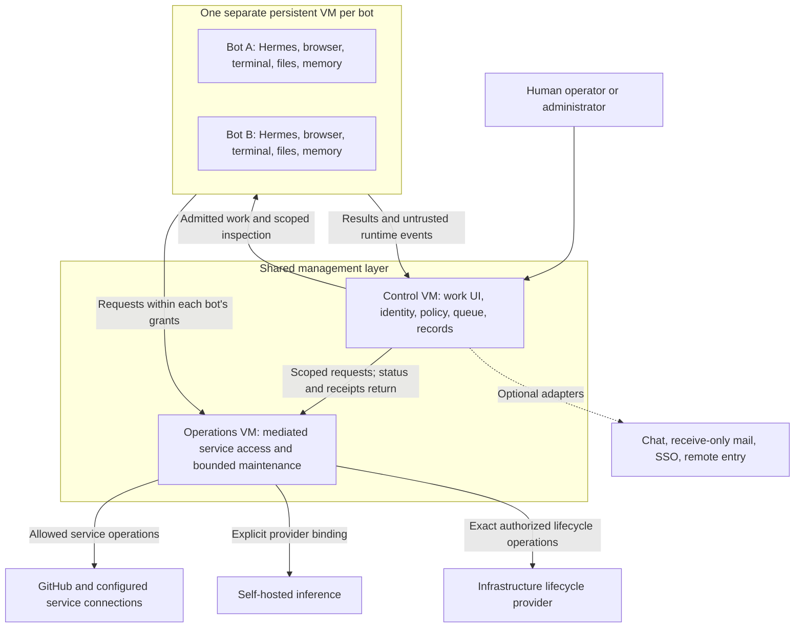

# Architecture and first-slice review

Status: chunk 1's two-management-VM default and overall responsibilities are
accepted for the public product. Chunk 2's administrator invitations, explicit
human roles, administrator-only SSO fallback and bot-wide pause after grant
withdrawal are also accepted for V1.
The rest of chunk 2, detailed contracts and later chunks remain under review;
these decisions do not implement or deploy the product.
Design depth: D3. Implementation authorization: none from this packet.

## Review sequence

Review one chunk at a time and revise the packet after each decision. Agreement
on a chunk does not silently accept later choices or authorize deployment.

| Chunk | Review outcome needed | State |
| --- | --- | --- |
| 1. Overall structure | Component responsibilities, trust boundaries, and default shared-VM footprint | Two shared management VMs accepted; detailed contracts remain to qualify |
| 2. Identity, access, and information | Human/bot/service identities, grants, private/project data ownership, and mediated operations | Human invitations, explicit roles, administrator-only SSO fallback and grant-withdrawal pause accepted; remaining contracts under review |
| 3. Work and recovery | Task/run state, admission, cancellation, delegation, inference changes, maintenance, and uncertain external effects | Follows chunk 2 |
| 4. Operator and administrator experience | Onboarding, first task, access requests, sharing, and recovery screens | Follows the accepted authority and work model |
| 5. Implementation design | Technology choices, packaging, schemas, typed contracts, module dependencies, and call paths | Follows the reviewed product boundaries |
| 6. First implementation slice | Exact files, behavior, tests, demonstration, limits, and acceptance for the offline foundation | Final implementation review |

The first implementation candidate remains an offline foundation using synthetic
identities/data and fake runtime, provider, and service adapters. Its intended
proof is that authorized work can persist through interruption and a provider's
backing-model change, while denied access and uncertain external effects remain
visible. This is a scope preview; chunk 6 will specify the implementation only
after the earlier contracts are reviewed. No live credentials or deployment
are needed for that candidate.

## Chunk 1: a small management layer and isolated bot computers

An operator should experience one product: their work, assigned bots, projects,
results, and requests for attention. The underlying design separates persistent
untrusted workers from the components that grant access and manage infrastructure.

### Accepted core deployment

**Two shared Linux VMs, plus one persistent VM per bot.** The shared VMs may run
on the same suitably sized physical host. They provide separation of guest
privilege and kernels; this is not high availability or physical fault isolation.

Arrows describe application contracts, not permission for unrestricted network
connections. The final network plan must specify direction, authentication, and
allowed operations. Public/private browsing profiles are a separate controlled
egress path. The operations VM may provide a narrow inference route, but never
an arbitrary proxy into the local network or a model-selection authority.

| Component | Responsibility | Authority boundary |
| --- | --- | --- |
| Control VM | Serve the interface; authenticate people; own roles, grants, bot/project/task records, shared content, queues, and audit receipts | Decide what is allowed; hold no raw hypervisor administration credentials. Ordinary application administrators do not automatically receive private content access. |
| Operations VM | Hold mediated service credentials; execute narrow service operations; carry out admitted provisioning, maintenance, and recovery actions | Validate caller identity, exact target, current grants, operation, expiry, and local target/budget ceilings. No generic shell or arbitrary URL/VM target supplied by a bot. |
| Bot VM | Run Hermes and the bot's browser/tools; retain files, installed software, and memory | Assume the bot environment can become compromised. Its credentials and network routes identify only that bot and its explicit grants, never an infrastructure administrator. |
| Optional shared services | Provide chat, mail, SSO, and guided remote entry through qualified adapters | Reuse existing services where suitable or install the selected profiles. Their presence cannot confer new bot permissions or become necessary for basic local fleet use. |
| CI workers | Execute admitted repository checks | Separate one-job disposable VMs for the local CI profile; never reuse persistent bot VMs or attach unrelated existing runner pools. GitHub-hosted remains the new-setup default. |

The operations VM contains separate narrowly scoped executors and service
identities for service access and infrastructure actions. Sharing that VM does
not grant a GitHub adapter a maintenance credential. It remains a shared trusted
guest: guest-root compromise can defeat process separation. Separate VMs for
each adapter are not proposed as the V1 default; revisit that boundary for a
demonstrated risk or a stronger supported deployment profile.

Network restrictions, guest limits, and infrastructure target ceilings must be
enforced outside worker control. The operations VM uses an existing bounded
lifecycle mechanism if its actual contract fits; otherwise its required adapter
must be designed and admitted explicitly. A management API or reachable Docker
socket is not itself authorization. A controller compromise is still serious;
the extra VM limits direct credential access and unrestricted infrastructure
reach but does not make the controller untrusted or remove it from the security
boundary.

### Where information lives

The control plane owns authoritative permissions, task/run status, publication
decisions, shared project artifacts, and protected receipts. Private content
served or stored centrally retains its original audience on every access path;
logs and aggregate dashboards do not become another copy of private history.
Bot-local files, memory, and runtime state persist inside that bot's VM and are
treated as worker-controlled content. Scoped inspection may stream content through
the control plane without granting ordinary administrators a new audience.

Shared content is released through the project/artifact contract, rather than
mounting other bots' private disks. Revocation prevents future access; it cannot
erase copies a bot already received. Chunk 2 will specify content stores, access
paths, and grant/publication records so these statements become enforceable.

Mediated access is the default. The accepted advanced direct scoped-token mode
remains available with its different custody and revocation limits disclosed.
Neither mode permits a bot to obtain hypervisor credentials. The infrastructure
owner's underlying host/storage power remains distinct from application privacy.

### The supervisor's place

Security and maintenance are platform responsibilities, not an all-powerful
worker bot. Deterministic checks and required notices continue without inference.
An isolated agent may explain the scoped operational evidence; it receives no
automatic access to private histories, service credentials, or privileged verbs.

For incidents, the supervisor observes, warns, and recommends; a human chooses
intervention. For maintenance, the standing weekly OS policy admits the concrete
plan, including advance work preparation and the accepted security-precedence
deadline. The operations executor applies that plan and records verification.
The language model cannot expand the maintenance scope or turn it into incident
quarantine. Optional private review remains inside the bot's privacy boundary
and releases limited findings through its existing contract.

### Keep the shared software small

Use one modular controller application for policy, scheduling, work records,
and the operator API, with one transactional store. Modules do not need separate
VMs or independently operated queue/policy/memory services. Executor boundaries
exist for actual credential/privilege differences. UI, language, database,
packaging, and process topology are recommendations to review in chunk 5, not
technology decisions settled by this diagram.

| Alternative / decision | Benefit | Cost or changed guarantee |
| --- | --- | --- |
| Two shared VMs — accepted default | A web/control-plane process does not share a guest kernel or filesystem with service credentials and infrastructure executors | Additional guest resources, networking, patching, and recovery to qualify; both guests still belong to the trusted management layer. |
| One shared management VM — not selected | Fewer guest resources and simpler initial deployment | Control, credential, and infrastructure execution share a guest kernel. Container/process hardening offers a different boundary; it must not be presented as equivalent to two VMs. |

The same public recipes should serve either Proxmox or suitably supplied Linux
VMs. The accepted default does not commit V1 to supporting a compact one-VM
profile. Actual sizing and targets require capacity
evidence; no host, VM identifier, network, or new standing grant is selected here.
Optional services may use existing infrastructure or separately qualified shared
service hosts. This diagram does not promise that all optional services fit in
the two core VMs' eventual resource budget.

The two-VM count describes the core management layer. It is not a promise that
every optional service belongs on those guests or that every installation needs
exactly the same total VM count. Optional-service placement follows the service's
credentials, data, network exposure, and recovery needs. Reusing a compatible
existing service or adding a dedicated service host can preserve the same public
contract through a private deployment overlay; exact optional profiles remain
to be qualified.

### Evidence and current limitations

The repository at baseline `22f6c8f` contains requirements and design documents,
not application source or tests. This packet proposes boundaries to implement.
Hermes documents an HTTP run API and ACP integration surfaces, which are
candidates for the worker adapter. Transport selection, version pins, recovery,
and tool interception must be qualified in the later chunks; documented methods
do not prove durable admission or safe replay.
[Hermes programmatic integration](https://hermes-agent.nousresearch.com/docs/developer-guide/programmatic-integration).

This chunk follows the accepted [work model](work-model.md),
[boundary experience](boundary-experience.md),
[supervisor contract](security-supervisor.md),
[CI setup](ci-and-runner-setup.md), and [observability](observability.md).
The remaining review chunks will refine this proposal rather than create a
second competing architecture. Final acceptance must include denied-access,
recovery, resource-pressure, and nontechnical usability evidence.

## Chunk 2: identity, access, and information

### Human admission and roles — accepted for V1

Administrators invite people and assign their roles explicitly in Radhouse.
Support local accounts and optional SSO; shared sign-in identifies the person,
while Radhouse owns their membership, role and resource grants. Being known to
the identity provider does not automatically admit someone to the installation.

The guided administrator flow should combine the invitation, role selection and
eligible bot assignments. The invited person signs in, completes required
enrollment and MFA, and reaches their assigned work home. A copyable invitation
does not require an outbound email service. Invitation delivery must not be
confused with the separate receive-only bot-mail integration.

| Responsibility | V1 authority |
| --- | --- |
| Human admission and admin/operator/viewer role | Explicit administrator action in Radhouse |
| Human sign-in | A local account or a qualified SSO binding, under the same accepted MFA policy |
| Bot allocation and service grants | Separate explicit administrator decisions; a role does not allocate every bot or confer service credentials |
| Project creation and sharing | The accepted operator-owned project model, respecting current membership and content permissions |
| Private bot histories | Existing private-by-default, explicit-sharing and disclosed-supervision rules; administrator status alone does not add a content audience |

SSO-group-based admission and role changes are deferred beyond V1. A group
change does not silently admit a person, promote them, or alter their Radhouse
role. Disabling an identity, revoking sessions and changing resource grants
still need enforceable lifecycle contracts; deferring group synchronization is
not a promise that an existing SSO session remains valid indefinitely.

### Fallback sign-in during an SSO outage — accepted for V1

Retain and test a designated local administrator sign-in with MFA when optional
SSO is enabled. Reuse the initial local administrator where appropriate; an
additional privileged identity needs a concrete reason. Its authentication and
recovery material must work without the unavailable identity provider.

SSO-only operators and viewers wait for provider recovery before signing in
again. Ordinary local accounts remain supported and usable under their current
permissions and MFA policy. Adding independent local fallback credentials for
selected SSO operators/viewers is deferred beyond V1; provider failure does not
auto-create an account or enable a weaker authentication method.

The recovery sign-in retains the designated person's current Radhouse authority.
It cannot revive a disabled account or revoked grant, manufacture administrator
status, or grant identity-provider, hypervisor or remote-edge repair powers.
Keep required MFA in force. This is application sign-in recovery, separate from
the encrypted-backup recovery kit and its key-custody contract.

Setup must prove a reachable management route and usable authentication factors
that do not depend on the failed provider. An already-authorized local route may
meet this requirement; a remote access gateway using the same provider may stay
unavailable. Do not create an automatic public bypass or weaken gateway policy.
Show recovery readiness and record scoped audit evidence when the route is used.

Qualify provider loss, unavailable provider-dependent ingress, incorrect or
missing MFA, disabled accounts, revoked recovery bindings and recovery material
stored behind the unavailable provider. Exact factor methods, enrollment and
replacement, session lifetime and revocation remain implementation contracts.
Existing sessions and background work keep their authorization/expiry rules;
this decision supplies no exception to those rules.

[OWASP MFA guidance](https://cheatsheetseries.owasp.org/cheatsheets/Multifactor_Authentication_Cheat_Sheet.html)
discusses dependency/lockout risks and secure recovery without exploitable bypass
flows. Administrator-only fallback is Radhouse's accepted V1 scope. These are
design and qualification requirements, not an implemented recovery route.

### Withdrawing a bot grant — accepted for V1

When an authorized human withdraws or narrows a bot's grant, block new use of the
removed permission and pause that bot's work for human review. Preserve durable
files and progress. Prevent new task, delegation and routine dispatch to the
paused bot; interrupt active work through the qualified control path. Other
bots may continue their independently authorized work, while dependent tasks
still obey their current root scope and grants.

For example, withdrawing repository access during a coding assignment pauses
the bot, including unrelated work on that same bot. Automatically continuing
selected tasks inside it is deferred beyond V1. The interface should preview
this impact, then show the changed grant, pause state and any unfinished effects.

An authorized human reviews and resumes the bot under its remaining permissions.
Resume cannot restore a revoked grant or unblock a task that still requires it.
This policy follows an explicit human access decision; it does not grant the
supervisor independent incident-quarantine authority or select routine VM
shutdown. Normal credential renewal, temporary service failures, provider
maintenance and ordinary sign-out are different events.

Enforce revocation outside the untrusted guest. A cooperative checkpoint or UI
pause flag does not prove containment of runtime/background activity. A bounded
local checkpoint may preserve work after revoked access is fenced; it must not
retain old external permissions to finish the task. The implementation must
qualify external enforcement, guest-wide containment where necessary, deadlines,
pause verification, restart persistence and resume revalidation.

Previously sent requests may complete. Record unknown outcomes and avoid blind
replay; do not claim to undo a completed effect or erase previously obtained
data. Direct tokens and browser sessions require separate upstream revocation
and containment evidence. Report pending or failed revocation plainly.
[OWASP authorization guidance](https://cheatsheetseries.owasp.org/cheatsheets/Authorization_Cheat_Sheet.html#validate-the-permissions-on-every-request)
supports checking current permissions on every request, and
[OAuth token revocation](https://www.rfc-editor.org/rfc/rfc7009.html#section-2.1)
recognizes propagation delay. The bot-wide pause is the accepted Radhouse policy.

Qualification must include a grant change racing a tool call, an unresponsive
runtime/background process, a copied direct token, delegated work and queued
routine dispatch, a controller restart while paused, and a resume attempt that
still lacks a required grant. Tests must distinguish a recorded pause request
from verified enforcement and preserve unaffected bots' independent work.

### Contracts still to qualify

Specify first-administrator bootstrap, invitation expiry/redemption, account
linking, MFA enrollment/recovery, disabling an account, session revocation and
the mechanisms implementing the accepted grant-withdrawal policy. Keep a stable
internal person identity and separately verified sign-in bindings. For OIDC, use the
validated issuer and subject binding; matching email addresses alone cannot
merge identities or take over an existing account. See the
[OpenID Connect claim-stability rules](https://openid.net/specs/openid-connect-core-1_0.html#ClaimStability).

Admission qualification must demonstrate that an invited person reaches only
their authorized work, an uninvited SSO user receives no fleet/project content,
missing required MFA prevents admission, and SSO group changes cannot grant
membership or promote a role. Account-linking cases must include a reused email
address. These are acceptance requirements for the later implementation slice,
not evidence of an implemented authentication system.

Bot/service identities, detailed enforcement and content-release contracts remain
under review. The accepted admission and withdrawal behavior does not settle
those remaining parts of chunk 2.
