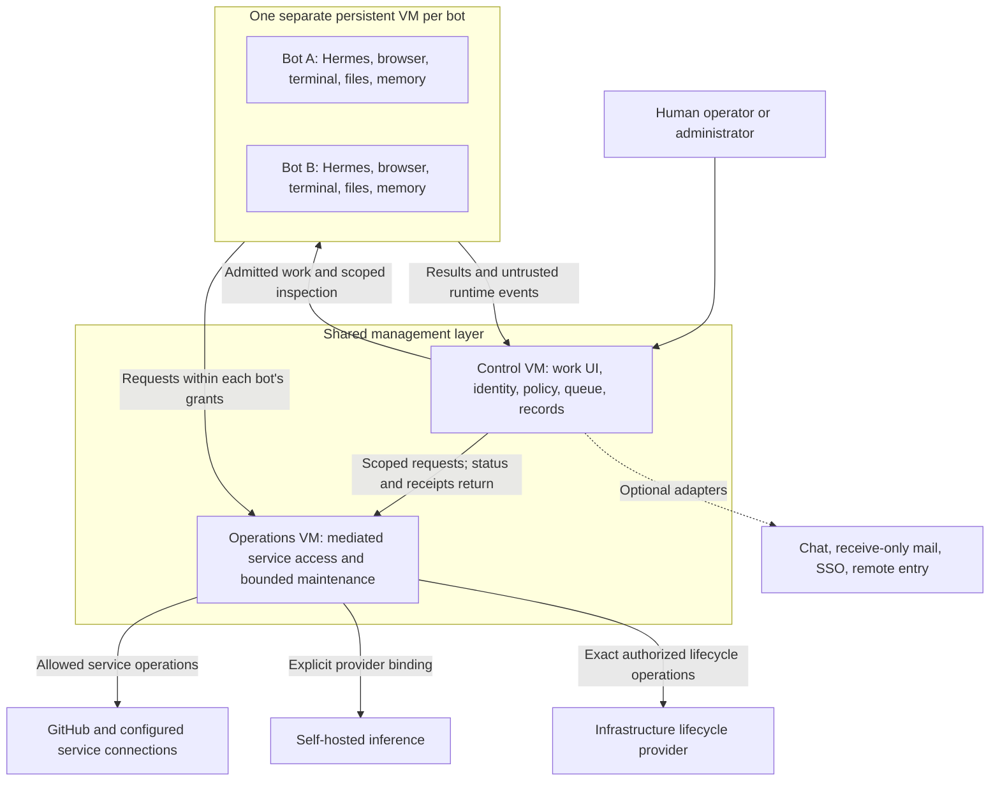

# Architecture and first-slice review

Status: chunk 1's two-management-VM default and overall responsibilities are
accepted for the public product. Chunk 2's administrator invitations, explicit
human roles, administrator-only SSO fallback, bot-wide pause after grant
withdrawal and fresh personal-bot replacement are also accepted for V1.
Chunk 2's combined identity/data boundary is accepted at the architecture level.
Chunk 3's bounded automatic recovery and bounded multitasking per bot are accepted
for V1; the remaining work/run lifecycle is proposed for review. Detailed contracts and later
chunks remain under review; these decisions do not implement or deploy the product.
Design depth: D3. Implementation authorization: none from this packet.

## Review sequence

Review one chunk at a time and revise the packet after each decision. Agreement
on a chunk does not silently accept later choices or authorize deployment.

| Chunk | Review outcome needed | State |
| --- | --- | --- |
| 1. Overall structure | Component responsibilities, trust boundaries, and default shared-VM footprint | Two shared management VMs accepted; detailed contracts remain to qualify |
| 2. Identity, access, and information | Human/bot/service identities, grants, private/project data ownership, and mediated operations | Combined boundary model accepted; concrete mechanisms remain to qualify |
| 3. Work and recovery | Task/run state, admission, cancellation, delegation, inference changes, maintenance, and uncertain external effects | Bounded automatic recovery and bounded multitasking accepted; remaining lifecycle and concrete mechanisms under review |
| 4. Operator and administrator experience | Onboarding, first task, access requests, sharing, and recovery screens | Earlier usability pilot accepted; detailed experience follows the accepted authority and work model |
| 5. Implementation design | Technology choices, packaging, schemas, typed contracts, module dependencies, and call paths | Follows the reviewed product boundaries |
| 6. First implementation slice | Exact files, behavior, tests, demonstration, limits, and acceptance for the offline foundation | Final implementation review |

The first implementation candidate remains an offline foundation using synthetic
identities/data and fake runtime, provider, and service adapters. Its intended
proof is that authorized work can persist through interruption and a provider's
backing-model change, while denied access and uncertain external effects remain
visible. This is a scope preview; chunk 6 will specify the implementation only
after the earlier contracts are reviewed. No live credentials or deployment
are needed for that candidate.

## Chunk 1: a small management layer and isolated bot computers

An operator should experience one product: their work, assigned bots, projects,
results, and requests for attention. The underlying design separates persistent
untrusted workers from the components that grant access and manage infrastructure.

### Accepted core deployment

**Two shared Linux VMs, plus one persistent VM per bot.** The shared VMs may run
on the same suitably sized physical host. They provide separation of guest
privilege and kernels; this is not high availability or physical fault isolation.

Arrows describe application contracts, not permission for unrestricted network
connections. The final network plan must specify direction, authentication, and
allowed operations. Public/private browsing profiles are a separate controlled
egress path. The operations VM may provide a narrow inference route, but never
an arbitrary proxy into the local network or a model-selection authority.

| Component | Responsibility | Authority boundary |
| --- | --- | --- |
| Control VM | Serve the interface; authenticate people; own roles, grants, bot/project/task records, shared content, queues, and audit receipts | Decide what is allowed; hold no raw hypervisor administration credentials. Ordinary application administrators do not automatically receive private content access. |
| Operations VM | Hold mediated service credentials; execute narrow service operations; carry out admitted provisioning, maintenance, and recovery actions | Validate caller identity, exact target, current grants, operation, expiry, and local target/budget ceilings. No generic shell or arbitrary URL/VM target supplied by a bot. |
| Bot VM | Run Hermes and the bot's browser/tools; retain files, installed software, and memory | Assume the bot environment can become compromised. Its credentials and network routes identify only that bot and its explicit grants, never an infrastructure administrator. |
| Optional shared services | Provide chat, mail, SSO, and guided remote entry through qualified adapters | Reuse existing services where suitable or install the selected profiles. Their presence cannot confer new bot permissions or become necessary for basic local fleet use. |
| CI workers | Execute admitted repository checks | Separate one-job disposable VMs for the local CI profile; never reuse persistent bot VMs or attach unrelated existing runner pools. GitHub-hosted remains the new-setup default. |

The operations VM contains separate narrowly scoped executors and service
identities for service access and infrastructure actions. Sharing that VM does
not grant a GitHub adapter a maintenance credential. It remains a shared trusted
guest: guest-root compromise can defeat process separation. Separate VMs for
each adapter are not proposed as the V1 default; revisit that boundary for a
demonstrated risk or a stronger supported deployment profile.

Network restrictions, guest limits, and infrastructure target ceilings must be
enforced outside worker control. The operations VM uses an existing bounded
lifecycle mechanism if its actual contract fits; otherwise its required adapter
must be designed and admitted explicitly. A management API or reachable Docker
socket is not itself authorization. A controller compromise is still serious;
the extra VM limits direct credential access and unrestricted infrastructure
reach but does not make the controller untrusted or remove it from the security
boundary.

### Where information lives

The control plane owns authoritative permissions, task/run status, publication
decisions, shared project artifacts, and protected receipts. Private content
served or stored centrally retains its original audience on every access path;
logs and aggregate dashboards do not become another copy of private history.
Bot-local files, memory, and runtime state persist inside that bot's VM and are
treated as worker-controlled content. Scoped inspection may stream content through
the control plane without granting ordinary administrators a new audience.

Shared content is released through the project/artifact contract, rather than
mounting other bots' private disks. Revocation prevents future access; it cannot
erase copies a bot already received. Chunk 2 will specify content stores, access
paths, and grant/publication records so these statements become enforceable.

Mediated access is the default. The accepted advanced direct scoped-token mode
remains available with its different custody and revocation limits disclosed.
Neither mode permits a bot to obtain hypervisor credentials. The infrastructure
owner's underlying host/storage power remains distinct from application privacy.

### The supervisor's place

Security and maintenance are platform responsibilities, not an all-powerful
worker bot. Deterministic checks and required notices continue without inference.
An isolated agent may explain the scoped operational evidence; it receives no
automatic access to private histories, service credentials, or privileged verbs.

For incidents, the supervisor observes, warns, and recommends; a human chooses
intervention. For maintenance, the standing weekly OS policy admits the concrete
plan, including advance work preparation and the accepted security-precedence
deadline. The operations executor applies that plan and records verification.
The language model cannot expand the maintenance scope or turn it into incident
quarantine. Optional private review remains inside the bot's privacy boundary
and releases limited findings through its existing contract.

### Keep the shared software small

Use one modular controller application for policy, scheduling, work records,
and the operator API, with one transactional store. Modules do not need separate
VMs or independently operated queue/policy/memory services. Executor boundaries
exist for actual credential/privilege differences. UI, language, database,
packaging, and process topology are recommendations to review in chunk 5, not
technology decisions settled by this diagram.

| Alternative / decision | Benefit | Cost or changed guarantee |
| --- | --- | --- |
| Two shared VMs — accepted default | A web/control-plane process does not share a guest kernel or filesystem with service credentials and infrastructure executors | Additional guest resources, networking, patching, and recovery to qualify; both guests still belong to the trusted management layer. |
| One shared management VM — not selected | Fewer guest resources and simpler initial deployment | Control, credential, and infrastructure execution share a guest kernel. Container/process hardening offers a different boundary; it must not be presented as equivalent to two VMs. |

The same public recipes should serve either Proxmox or suitably supplied Linux
VMs. The accepted default does not commit V1 to supporting a compact one-VM
profile. Actual sizing and targets require capacity
evidence; no host, VM identifier, network, or new standing grant is selected here.
Optional services may use existing infrastructure or separately qualified shared
service hosts. This diagram does not promise that all optional services fit in
the two core VMs' eventual resource budget.

The two-VM count describes the core management layer. It is not a promise that
every optional service belongs on those guests or that every installation needs
exactly the same total VM count. Optional-service placement follows the service's
credentials, data, network exposure, and recovery needs. Reusing a compatible
existing service or adding a dedicated service host can preserve the same public
contract through a private deployment overlay; exact optional profiles remain
to be qualified.

### Evidence and current limitations

The repository at baseline `22f6c8f` contains requirements and design documents,
not application source or tests. This packet proposes boundaries to implement.
Hermes documents an HTTP run API and ACP integration surfaces, which are
candidates for the worker adapter. Transport selection, version pins, recovery,
and tool interception must be qualified in the later chunks; documented methods
do not prove durable admission or safe replay.
[Hermes programmatic integration](https://hermes-agent.nousresearch.com/docs/developer-guide/programmatic-integration).

This chunk follows the accepted [work model](work-model.md),
[boundary experience](boundary-experience.md),
[supervisor contract](security-supervisor.md),
[CI setup](ci-and-runner-setup.md), and [observability](observability.md).
The remaining review chunks will refine this proposal rather than create a
second competing architecture. Final acceptance must include denied-access,
recovery, resource-pressure, and nontechnical usability evidence.

## Chunk 2: identity, access, and information

### Human admission and roles — accepted for V1

Administrators invite people and assign their roles explicitly in Radhouse.
Support local accounts and optional SSO; shared sign-in identifies the person,
while Radhouse owns their membership, role and resource grants. Being known to
the identity provider does not automatically admit someone to the installation.

The guided administrator flow should combine the invitation, role selection and
eligible bot assignments. The invited person signs in, completes required
enrollment and MFA, and reaches their assigned work home. A copyable invitation
does not require an outbound email service. Invitation delivery must not be
confused with the separate receive-only bot-mail integration.

| Responsibility | V1 authority |
| --- | --- |
| Human admission and admin/operator/viewer role | Explicit administrator action in Radhouse |
| Human sign-in | A local account or a qualified SSO binding, under the same accepted MFA policy |
| Bot allocation and service grants | Separate explicit administrator decisions; a role does not allocate every bot or confer service credentials |
| Project creation and sharing | The accepted operator-owned project model, respecting current membership and content permissions |
| Private bot histories | Existing private-by-default, explicit-sharing and disclosed-supervision rules; administrator status alone does not add a content audience |

SSO-group-based admission and role changes are deferred beyond V1. A group
change does not silently admit a person, promote them, or alter their Radhouse
role. Disabling an identity, revoking sessions and changing resource grants
still need enforceable lifecycle contracts; deferring group synchronization is
not a promise that an existing SSO session remains valid indefinitely.

### Fallback sign-in during an SSO outage — accepted for V1

Retain and test a designated local administrator sign-in with MFA when optional
SSO is enabled. Reuse the initial local administrator where appropriate; an
additional privileged identity needs a concrete reason. Its authentication and
recovery material must work without the unavailable identity provider.

SSO-only operators and viewers wait for provider recovery before signing in
again. Ordinary local accounts remain supported and usable under their current
permissions and MFA policy. Adding independent local fallback credentials for
selected SSO operators/viewers is deferred beyond V1; provider failure does not
auto-create an account or enable a weaker authentication method.

The recovery sign-in retains the designated person's current Radhouse authority.
It cannot revive a disabled account or revoked grant, manufacture administrator
status, or grant identity-provider, hypervisor or remote-edge repair powers.
Keep required MFA in force. This is application sign-in recovery, separate from
the encrypted-backup recovery kit and its key-custody contract.

Setup must prove a reachable management route and usable authentication factors
that do not depend on the failed provider. An already-authorized local route may
meet this requirement; a remote access gateway using the same provider may stay
unavailable. Do not create an automatic public bypass or weaken gateway policy.
Show recovery readiness and record scoped audit evidence when the route is used.

Qualify provider loss, unavailable provider-dependent ingress, incorrect or
missing MFA, disabled accounts, revoked recovery bindings and recovery material
stored behind the unavailable provider. Exact factor methods, enrollment and
replacement, session lifetime and revocation remain implementation contracts.
Existing sessions and background work keep their authorization/expiry rules;
this decision supplies no exception to those rules.

[OWASP MFA guidance](https://cheatsheetseries.owasp.org/cheatsheets/Multifactor_Authentication_Cheat_Sheet.html)
discusses dependency/lockout risks and secure recovery without exploitable bypass
flows. Administrator-only fallback is Radhouse's accepted V1 scope. These are
design and qualification requirements, not an implemented recovery route.

### Withdrawing a bot grant — accepted for V1

When an authorized human withdraws or narrows a bot's grant, block new use of the
removed permission and pause that bot's work for human review. Preserve durable
files and progress. Prevent new task, delegation and routine dispatch to the
paused bot; interrupt active work through the qualified control path. Other
bots may continue their independently authorized work, while dependent tasks
still obey their current root scope and grants.

For example, withdrawing repository access during a coding assignment pauses
the bot, including unrelated work on that same bot. Automatically continuing
selected tasks inside it is deferred beyond V1. The interface should preview
this impact, then show the changed grant, pause state and any unfinished effects.

An authorized human reviews and resumes the bot under its remaining permissions.
Resume cannot restore a revoked grant or unblock a task that still requires it.
This policy follows an explicit human access decision; it does not grant the
supervisor independent incident-quarantine authority or select routine VM
shutdown. Normal credential renewal, temporary service failures, provider
maintenance and ordinary sign-out are different events.

Enforce revocation outside the untrusted guest. A cooperative checkpoint or UI
pause flag does not prove containment of runtime/background activity. A bounded
local checkpoint may preserve work after revoked access is fenced; it must not
retain old external permissions to finish the task. The implementation must
qualify external enforcement, guest-wide containment where necessary, deadlines,
pause verification, restart persistence and resume revalidation.

Previously sent requests may complete. Record unknown outcomes and avoid blind
replay; do not claim to undo a completed effect or erase previously obtained
data. Direct tokens and browser sessions require separate upstream revocation
and containment evidence. Report pending or failed revocation plainly.
[OWASP authorization guidance](https://cheatsheetseries.owasp.org/cheatsheets/Authorization_Cheat_Sheet.html#validate-the-permissions-on-every-request)
supports checking current permissions on every request, and
[OAuth token revocation](https://www.rfc-editor.org/rfc/rfc7009.html#section-2.1)
recognizes propagation delay. The bot-wide pause is the accepted Radhouse policy.

Qualification must include a grant change racing a tool call, an unresponsive
runtime/background process, a copied direct token, delegated work and queued
routine dispatch, a controller restart while paused, and a resume attempt that
still lacks a required grant. Tests must distinguish a recorded pause request
from verified enforcement and preserve unaffected bots' independent work.

### A personal bot for a different operator — accepted for V1

When a different operator needs a role previously filled by a personal bot,
provide a fresh environment from the maintained template, a new bot identity
and explicit grants. Reuse approved role/software templates. Do not clone the
previous operator's used disk or transfer their credentials, browser sessions
or private memory merely by changing the assigned person.

Use the existing project-sharing flow for selected work: a source-authorized
human reviews the exact content and audience before release. A dedicated
selective-handover wizard is deferred beyond V1. Imported material remains
untrusted data and cannot automatically execute or expand permissions.

Keep the original data under its original audience until a separately authorized
lifecycle action changes its disposition. Replacement does not authorize
deletion or indefinite archival; apply capacity and retention policies explicitly.
Make the new identity/history visible even if a familiar display name is reused.
This decision does not reset a bot between ordinary tasks, prevent authorized
project collaboration, or change hardware migration for the same bot and person.

Qualification must show clean template provenance, absence of old credentials
and private state, current grants on the new bot, exact-content/audience release
and preservation of the original data boundary. A reused label or restored disk
cannot impersonate the previous bot or revive its grants. See the accepted
[work model](work-model.md) and
[memory/context risks](https://cheatsheetseries.owasp.org/cheatsheets/AI_Agent_Security_Cheat_Sheet.html#3-memory-context-security).

### Combined identity and data boundary — accepted boundary model

The following accepted model connects the earlier decisions and settles component
responsibilities at the architecture level. It introduces no new standing service
or identity-provider product. Exact schemas, transports, factor methods and
implementation authorization remain for the later design chunks.

| Concept | Accepted boundary contract | Does not imply |
| --- | --- | --- |
| Person | A stable internal person ID with verified local/SSO bindings; current role and resource grants live in the control plane | Successful login, group names or possession of an old session grant access to every bot/project |
| Bot and running instance | A durable bot ID plus an authenticated current runtime instance, tied to that bot's registered environment and allowed operations | A display name, role prompt, cloned disk or older runtime instance can impersonate a current worker |
| Service connection | A named, scoped upstream connection managed through the operations layer in mediated mode, with attribution to the requesting bot and task | The worker receives human sign-in factors or infrastructure administration credentials |
| Admitted task | A record binding the authorizing human, eligible bot/project, purpose, inputs, allowed effects and limits; delegated work stays within that root authority | A bot's maximum available grants authorize every possible action or an unrelated follow-up |
| Project and artifact | A shared workspace whose content has an explicit audience; private contributions require exact-content/audience release by an authorized human | Project membership exposes a member bot's private memory or adds service permissions |

Implement these contracts in the planned registry, task, grant, publication and
audit modules in the control plane. In the mediated path, the executor authenticates the
current bot/runtime and checks task scope, current grants, exact target and
operation, and configured infrastructure limits before using an upstream
credential. A stale or unverifiable authorization state cannot grant new use.
The adapter need not create a separate upstream account for every bot where a
qualified scoped shared integration can provide the required attribution and
isolation. External service identity and internal bot identity are distinct.

Bot-readable instance credentials identify only that bot's admitted reach; theft
inside the guest must not yield another identity or broader infrastructure power.
The runtime-instance contract must fence obsolete workers and credentials across
replacement, restore and reconnect. Exact issuance, expiry, validation and
revocation mechanisms remain to qualify. Human MFA/SSO authentication material
stays outside bot runtimes.

The accepted advanced direct-token mode retains its separate guarantees. A
copied upstream token may bypass Radhouse's per-operation mediation; enforcement
then depends on qualified upstream scopes, network controls and actual token
revocation. Do not claim the mediated contract automatically applies to raw
tokens, direct browser sessions or arbitrary software installed in a bot VM.

For a private repository-research task, the flow is:

1. The operator chooses an eligible bot and describes the work in a private
   context. The control plane validates their authority and admits the scope.
2. The bot requests a named repository read. The operations executor verifies
   the bot/runtime, current task and grants, then performs the permitted read.
3. The result returns under the task's audience. The draft report and private
   context do not become visible to project members merely because the bot also
   belongs to that project.
4. Sharing a report uses a reviewed content version and named audience. Recheck
   release authority at publication and access at retrieval; changed content or
   recipients invalidate the previous release decision.

Private bot-local state remains in its bot environment. Central streams, stores,
receipts and search results preserve the applicable audience; logs and metadata
are not an alternate publication path. Worker-supplied labels and file paths
cannot grant sharing authority. Bind approval to the actual content version
served by the trusted publication path, with path/revision checks before release.
Revocation restricts future access and cannot erase already delivered copies.

Task scope is an authorization boundary, not proof that the bot has forgotten
other projects. Disclose its wider retained context. When separate confidentiality
is required, use a fresh bot or keep work within its existing private audience;
do not promise isolation by changing a project label or narrowing selected inputs.

The supervisor consumes permitted operational evidence and limited opt-in private
review findings. It does not gain a general content audience or grant authority.
Human incident intervention and the deterministic standing maintenance policy
keep their separately accepted scopes.

Boundary qualification includes forged bot/runtime identity, stale task/grant
state, a more-privileged peer used to bypass root scope, disclosure through task
names/logs/search, changed content after approval, and misleading scope labels
when a bot retains other private context. The later slice must make denials and
unfinished enforcement visible rather than treating a diagram as proof.

### Contracts still to qualify

Specify first-administrator bootstrap, invitation expiry/redemption, account
linking, MFA enrollment/recovery, disabling an account, session revocation and
the mechanisms implementing the accepted grant-withdrawal policy. Keep a stable
internal person identity and separately verified sign-in bindings. For OIDC, use the
validated issuer and subject binding; matching email addresses alone cannot
merge identities or take over an existing account. See the
[OpenID Connect claim-stability rules](https://openid.net/specs/openid-connect-core-1_0.html#ClaimStability).

Admission qualification must demonstrate that an invited person reaches only
their authorized work, an uninvited SSO user receives no fleet/project content,
missing required MFA prevents admission, and SSO group changes cannot grant
membership or promote a role. Account-linking cases must include a reused email
address. These are acceptance requirements for the later implementation slice,
not evidence of an implemented authentication system.

The combined identity/data boundary above is accepted. Its concrete instance,
grant and content-release mechanisms remain qualification work. Chunk 3 now
addresses task/run state, scheduling, interruption, resume and uncertain effects;
chunk 5 specifies the program interfaces before implementation.

## Chunk 3: work, interruption and recovery — proposed review

### Keep the task separate from its execution attempts

Keep one durable task for the authorized outcome and record each execution attempt
or checkpoint continuation as a run. A restart does not create a new objective,
reset budgets or authorize another external effect. Store authoritative task/run
state and operation receipts in the control plane; the worker's memory is useful
continuation context, not proof that an operation completed.

Proposed operator-facing states:

| State | Meaning |
| --- | --- |
| Queued | The request is recorded and awaiting an eligible bot or capacity; revalidate current authority before dispatch |
| Working | A current run has verified authority and the execution resources needed to proceed |
| Waiting | The task is awaiting a dependency, provider or human input, with a visible reason and no inference polling loop |
| Recovering | An unexpected interruption is being reconciled; this is not proof that agent execution has resumed |
| Paused | An explicit human or accepted grant-withdrawal hold prevents execution until authorized review/resume |
| Needs attention | A checkpoint, action outcome, compatibility or authority issue prevents safe continuation |
| Finished / Cancelled | A terminal outcome with permitted results or partial-work evidence; neither state implies every external effect can be undone |

### Bounded multitasking per bot — accepted for V1

The earlier one-active-task-per-bot proposal was a V1 simplification, not an
established Hermes limit. It reduced coordination of shared state, attribution
and recovery, but would also hold up independent work unnecessarily. That blanket
restriction is superseded by the accepted bounded-multitasking direction.

Hermes documents [parallel background subagents](https://hermes-agent.nousresearch.com/docs/user-guide/features/delegation)
while the parent conversation remains available. Its
[Runs API](https://hermes-agent.nousresearch.com/docs/user-guide/features/api-server)
serializes competing turns on the same session. The delegation guide also
documents optional Git worktrees, with a shared-directory fallback when the
feature is unsupported. These are distinct concurrency mechanisms; none proves
arbitrary simultaneous tasks safe in a shared bot environment.

Allow bounded multitasking within a bot's existing authority and resource
budget. Preserve each task's identity, audience, limits and cancellation lineage.
A task waiting for input or a long-running command should not, by itself, prevent
unrelated admitted work. Retain one current owner for a given run/attempt and
serialize conflicting updates to the same conversation or shared resource.
This prevents duplicate execution of one run without serializing the whole bot.

| Work combination | Accepted direction; implementation still to qualify |
| --- | --- |
| Independent research or analysis with separate outputs | Permit overlap when the adapter can preserve attribution, task scope and resource limits |
| A build runs while another task prepares a document | Allow useful overlap if their files, environment and required resources do not conflict; a background process retains its owning task |
| Two edits to one checkout, two controllers of one browser session, or competing shared-memory updates | Use qualified separation or coordinate exclusive access to the affected resource; otherwise queue the conflicting work |
| A task waits for a human decision | Preserve the hold on that task and its descendants; unrelated admitted tasks may progress. Accepted bot-wide grant-withdrawal holds still stop the whole affected bot |

Prefer Hermes's existing session, delegation and workspace mechanisms where they
meet the contract. Do not build a universal file-locking or scheduling layer
before demonstrating a gap. Separate conversations/worktrees coordinate work;
they do not isolate mutually untrusted tasks or private audiences inside a bot
VM. A worker's assertion of independence or a silent worktree fallback is not
enough to admit a combination whose safety depends on separation. For arbitrary
tools or unqualified shared resources, queue the affected work and disclose why.

Runtime subagents, if qualified, are temporary execution helpers inside the same
bot boundary. They do not create persistent fleet bots, new identities or wider
grants. Map every helper to an admitted task and its aggregate budget, provider
binding, effects and stop/recovery contract. Delegation to existing project bots
retains its separately accepted access rules. Task grants cannot be pooled to
authorize a wider operation. Retained context remains a bot-level concern;
different task labels do not prove confidentiality between those tasks.

The supported combinations and numerical concurrency limits must be measured
for the selected Hermes version, tools and deployment. Keep inference admission
separate from VM readiness and follow configured service priorities. The first
offline proof may exercise one execution path without making one active task a
permanent product restriction. Multiple active tasks do not promise simultaneous
model generations or a proportional speedup.

Human-configured schedules and enabled proactive standing assignments create
bounded occurrences through the same admission path. Deduplicate submissions,
occurrences and dispatch after retries. Human cancellation blocks new descendant
work and requests termination of outstanding runs, while recording any in-flight
effects honestly. Detailed queue fairness, timeout values, missed-occurrence and
transition-race rules remain program-design work.

### Unexpected interruption: accepted V1 resume default

Use **bounded automatic recovery when continuation is verified safe**.
Reconcile the current runtime before dispatching another attempt. An older attempt
of the same run must be confirmed inactive, safely adopted or fenced from acting;
a missing heartbeat alone cannot justify duplicate owners of that run or its
exclusively held resources. Check the durable checkpoint
against current workspace revisions, versions, identity, grants, task scope and
remaining budgets. Preserve newer drafts/files; this is not an automatic restore
of an older backup over the working environment.

When the checks pass and pending effects are resolved or demonstrably safe to
repeat, continue the same admitted work and record the recovery. Use qualified
per-adapter recovery behavior, bounded attempt/time limits and delayed retries.
An LLM's assurance that continuation is safe is not the recovery gate. Repeated
failure, missing evidence, incompatible state or unresolved effects becomes
Needs attention with the preserved checkpoint and a clear explanation.

Requiring human confirmation after every unexpected interruption was not selected
as the V1 default. Human review remains necessary when safe continuation cannot
be established.

Automatic recovery preserves human pause/cancellation, grant-withdrawal holds,
manual VM stop and current authority. It does not power on a manually stopped bot because a
task is queued or restart an assignment that was cancelled. The accepted weekly
maintenance save/verify/resume path is separate; this choice does not add manual
confirmation to every planned maintenance cycle.
Human confirmation alone cannot bypass a failed authority or compatibility check;
an unresolved problem needs a concrete, authorized recovery action.

### Reconcile effects before replay

Record the intended operation, exact task/target and request identity before
dispatch, then retain submitted/confirmed/unknown outcomes. A connection failure
or missing response cannot establish that nothing happened. Where a qualified
adapter supports an idempotency key or authoritative status lookup, use it to
resolve the same operation. Confirm the observed result corresponds to the
intended operation; a similar-looking artifact is not sufficient evidence.

For example, if connection is lost while creating a pull request, inspect the
qualified upstream identity/result before attempting another creation. A confirmed
success can be reconciled without repeating it. An unresolved outcome waits for
human review; a human retry decision must disclose any remaining duplicate-effect
risk and cannot manufacture evidence that the first attempt failed.

Local writes, browser actions and advanced direct-token work need their own
recovery capability classification. An HTTP verb, a task's role label or a
tool's self-description is insufficient to classify the entire run as replayable.
Do not promise exactly-once behavior for arbitrary third-party tools. The
[HTTP retry rules](https://www.rfc-editor.org/rfc/rfc9110.html#section-9.2.2)
likewise distinguish requests whose effects can safely be repeated from requests
that require evidence before automatic retry.

Provider unavailability leaves the task waiting within its limits. Recheck the
configured provider/model policy, current capabilities and checkpoint/input
compatibility when service returns or its backing model changes. Preserve bot
identity and work, report the model actually used and do not silently change the
selected provider. Resource priority remains with interactive applications and
requests. Exact streaming/tool-call reconciliation belongs in the adapter contract.

### Work/recovery qualification still required

Prove interrupted admission, duplicate dispatch, worker/controller reconnect,
an old worker returning after replacement, a crash after an external effect but
before its receipt, current-grant changes during recovery, a newer local edit,
provider/model changes, a manually paused/stopped bot and exhausted retry budgets.
Concurrency qualification must also cover conflicting checkout/browser/memory
use, unsupported separation, task-scoped cancellation with siblings running,
bot-wide grant withdrawal, per-task result delivery and aggregate resource limits.
The offline first slice can exercise synthetic state and fake effect adapters;
it cannot establish live runtime or provider guarantees. Automatic recovery and
bounded multitasking are accepted; the remaining state model and concrete
mechanisms remain under review.

## Creator interview: implications for the current review

Review date: 2026-09-10. The supplied transcript of
[Roman Ugarte's Grok Bot interview](https://www.lennysnewsletter.com/p/how-we-built-grok-bot-in-a-month)
informs the product observations below. They are the team's account of its
experience, not independent performance or security evidence. The implications
are Radhouse design judgments; proposed refinements do not silently change the
accepted V1 scope.

### Keep the accepted boundaries

Grok Bot's [current FAQ](https://docs.x.ai/grok-bot/faq) describes one computer
per user, with files and browser logins shared between that user's bots.
Separate screens do not provide per-bot isolation. Retain Radhouse's separate
bot VMs, explicit grants and reviewed sharing. A bot's independent computer
should make work independent of an operator's laptop; a qualified self-hosted
deployment provides that arrangement while its host and required
services remain available.

Retain Hermes first, optional Chief of Staff coordination, selected self-hosted
inference, mediated credentials by default, and human control of new authority.
The interview offers no compatibility evidence that would justify changing
these decisions. Reusing Hermes does not require making its developer interface
the operator's work home. Do not infer a one-month delivery estimate from another
team's launch story.

### Refinements worth making concrete

| Interview observation | Proposed application within Radhouse |
| --- | --- |
| The team watched many new users attempt real work and removed confusing interface elements | Test an unfamiliar nontechnical operator early. Make the default task view show the requested outcome, brief progress, result and need for attention; keep scoped technical inspection available. Missing or stale evidence must still be visible. |
| A useful colleague completes a meaningful piece of work across tools | Qualify complete workflows, including artifact quality and source checks, alongside boundary and recovery tests. Record interventions, completion failures, latency and resource cost for each supported runtime/model combination. Do not substitute a successful chat response for task completion. |
| People describe routines in conversation | Let a human request a routine in plain language. Show its interpreted task, bot/project, sources, audience, timezone/timing and limits in an editable summary. Resolve missing or consequential ambiguity and obtain any missing authority before activation. Human configuration need not require a workflow-builder form; bot suggestions still cannot enable recurrence. Exact activation interaction remains to design. |
| A principal bot emerged naturally, while people still worked with specialists | Keep the Chief of Staff optional. It may coordinate permitted context and existing bots; its title cannot make it an all-seeing router or enlarge project access. |
| The team uses its own bots to test product workflows | Use isolated synthetic accounts and fixtures for repeatable journey tests; review failures against explicit expected outcomes. This does not authorize recursive bot creation, real-account experimentation or treating a bot's self-report as a passing test. |

Computer use deserves explicit qualification. A model-compatible text API alone
does not prove usable browser interaction, tool calling or durable recovery.
For a service-following inference binding, preserve identity and work across a
backing-model change, but check the actual served model against the task's
required capabilities before continuing. Show a blocked/waiting reason when
qualification or compatibility is missing; do not promise equivalent competence
or silently select another provider.

A logged-in browser may carry broader powers than a mediated connector. Calling
an assignment read-only cannot constrain an arbitrary authenticated website.
Apply the existing service/session and egress contracts to each supported path;
unqualified private-site automation is not part of a generic compatibility claim.
Voice huddles, demonstration recording and a public template marketplace are
ideas for later review, not additions to the current release commitments.

### Earlier usability pilot — accepted delivery refinement

Bring a thin operator work home into the first live single-bot pilot, after the
proposed offline foundation. This moves nontechnical usability proof forward
from milestone 5. It does not remove V1 fleet, GitHub, identity or optional-service
scope. The delivery refinement is accepted; implementation remains unapproved.

| Delivery choice | What the next live proof demonstrates |
| --- | --- |
| Useful operator workflow early — accepted | An unfamiliar operator gives one eligible persistent bot a bounded research task, sees truthful progress and a permission boundary, finds a cited artifact and returns to retained work. Include the minimum real identity/access enforcement needed for that pilot. |
| Runtime/API proof first — not selected | Establish live Hermes execution, persistence and recovery through an administrative/API harness first; add the everyday operator interface in a subsequent slice. Usability feedback arrives later, with less interface work in the initial live proof. |

Retain the offline synthetic foundation as the first implementation candidate,
technical contracts before implementation and deployment-specific qualification
before live access. No private account or infrastructure is admitted by selecting
a delivery order. A pilot is not a V1 release: remaining
roles, collaboration, GitHub, optional integrations and release gates still
need their own evidence. The exact first-slice packet remains to review.

### Review continuity: work and recovery

The proposed combined lifecycle incorporates the accepted concurrency direction:
one durable outcome with bounded runs, bounded multitasking within each bot,
coordination of conflicting resources and delegation to eligible existing bots,
visible waiting/attention states, and the accepted recovery default. Planned schedules
and proactive work enter through the same admission and budget controls.
Humans retain priority/cancellation and grant decisions; unknown external
effects wait for reconciliation instead of blind replay.

One foreground assignment with later top-level work queued was not selected as
the V1 product policy. The concurrency direction is accepted; numerical limits,
resource coordination, runtime transports and concrete transition rules still
require design and qualification. This acceptance does not authorize implementation.

## Chunk 4: operator journey — proposed review

Start with the existing work home and context card. The accepted boundary model
already requires visible context/audience, current authority checks and explicit
decisions for new access or sharing. The next UX choice concerns how much
confirmation to require for ordinary work inside an already visible context.

The [task-start interaction](boundary-experience.md#starting-a-task--proposed-interaction)
proposes that sending a sufficiently specified request starts work when the
eligible bot, context and audience are already shown. Missing information or a
boundary change gets a targeted question. The alternative is a separate brief
review and Start action for every new task. This interaction remains pending;
it does not change grants, publish private material or admit a new model route.
