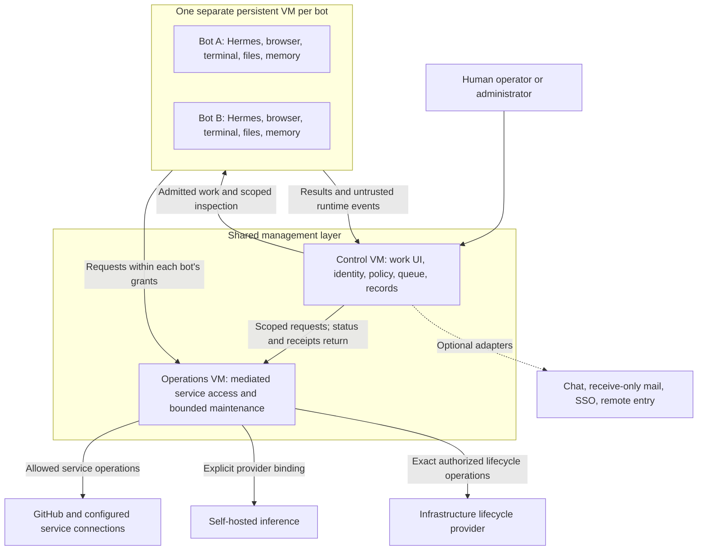

# Architecture and first-slice review

Status: chunk 1's two-management-VM default and overall responsibilities are
accepted for the public product. Chunk 2's administrator invitations, explicit
human roles, administrator-only SSO fallback, bot-wide pause after grant
withdrawal and fresh personal-bot replacement are also accepted for V1.
Chunk 2's combined identity/data boundary is accepted at the architecture level.
Chunk 3's bounded automatic recovery and bounded multitasking per bot are accepted
for V1; the remaining work/run lifecycle is proposed for review. Chunk 4's combined
operator journey and chunk 5A's Python controller and TypeScript interface are
accepted. Chunk 5B proposes module ownership and durable task contracts; detailed
qualification and the first slice remain under review. Full operator equivalence
with optional Buzz, including native protected reviews/approvals, is also an
accepted V1 requirement. Testing both in the early usability pilot is accepted;
chunk 6 now proposes the first bounded offline implementation. These decisions do not
implement or deploy the product.
Design depth: D3. Implementation authorization: none from this packet.

## Review sequence

Review one chunk at a time and revise the packet after each decision. Agreement
on a chunk does not silently accept later choices or authorize deployment.

| Chunk | Review outcome needed | State |
| --- | --- | --- |
| 1. Overall structure | Component responsibilities, trust boundaries, and default shared-VM footprint | Two shared management VMs accepted; detailed contracts remain to qualify |
| 2. Identity, access, and information | Human/bot/service identities, grants, private/project data ownership, and mediated operations | Combined boundary model accepted; concrete mechanisms remain to qualify |
| 3. Work and recovery | Task/run state, admission, cancellation, delegation, inference changes, maintenance, and uncertain external effects | Bounded automatic recovery and bounded multitasking accepted; remaining lifecycle and concrete mechanisms under review |
| 4. Operator and administrator experience | Onboarding, first task, access requests, sharing, and recovery screens | Combined operator journey accepted; implementation and usability qualification remain pending |
| 5. Implementation design | Technology choices, packaging, schemas, typed contracts, module dependencies, and call paths | Chunk 5A stack direction accepted; chunk 5B module ownership and durable task contracts proposed |
| 6. First implementation slice | Exact files, behavior, tests, demonstration, limits, and acceptance for the offline foundation | VS0-A proposed below; implementation approval pending |

The first implementation candidate remains an offline foundation using synthetic
identities/data and fake runtime, provider, and service adapters. Its intended
proof is that authorized work can persist through interruption and a provider's
backing-model change, while denied access and uncertain external effects remain
visible. This is a scope preview; chunk 6 will specify the implementation only
after the earlier contracts are reviewed. No live credentials or deployment
are needed for that candidate.

## Chunk 1: a small management layer and isolated bot computers

An operator should experience one product: their work, assigned bots, projects,
results, and requests for attention. The underlying design separates persistent
untrusted workers from the components that grant access and manage infrastructure.

### Accepted core deployment

**Two shared Linux VMs, plus one persistent VM per bot.** The shared VMs may run
on the same suitably sized physical host. They provide separation of guest
privilege and kernels; this is not high availability or physical fault isolation.



Arrows describe application contracts, not permission for unrestricted network
connections. The final network plan must specify direction, authentication, and
allowed operations. Public/private browsing profiles are a separate controlled
egress path. The operations VM may provide a narrow inference route, but never
an arbitrary proxy into the local network or a model-selection authority.

| Component | Responsibility | Authority boundary |
| --- | --- | --- |
| Control VM | Serve the interface; authenticate people; own roles, grants, bot/project/task records, shared content, queues, and audit receipts | Decide what is allowed; hold no raw hypervisor administration credentials. Ordinary application administrators do not automatically receive private content access. |
| Operations VM | Hold mediated service credentials; execute narrow service operations; carry out admitted provisioning, maintenance, and recovery actions | Validate caller identity, exact target, current grants, operation, expiry, and local target/budget ceilings. No generic shell or arbitrary URL/VM target supplied by a bot. |
| Bot VM | Run Hermes and the bot's browser/tools; retain files, installed software, and memory | Assume the bot environment can become compromised. Its credentials and network routes identify only that bot and its explicit grants, never an infrastructure administrator. |
| Optional shared services | Provide chat, mail, SSO, and guided remote entry through qualified adapters | Reuse existing services where suitable or install the selected profiles. Their presence cannot confer new bot permissions or become necessary for basic local fleet use. |
| CI workers | Execute admitted repository checks | Separate one-job disposable VMs for the local CI profile; never reuse persistent bot VMs or attach unrelated existing runner pools. GitHub-hosted remains the new-setup default. |

The operations VM contains separate narrowly scoped executors and service
identities for service access and infrastructure actions. Sharing that VM does
not grant a GitHub adapter a maintenance credential. It remains a shared trusted
guest: guest-root compromise can defeat process separation. Separate VMs for
each adapter are not proposed as the V1 default; revisit that boundary for a
demonstrated risk or a stronger supported deployment profile.

Network restrictions, guest limits, and infrastructure target ceilings must be
enforced outside worker control. The operations VM uses an existing bounded
lifecycle mechanism if its actual contract fits; otherwise its required adapter
must be designed and admitted explicitly. A management API or reachable Docker
socket is not itself authorization. A controller compromise is still serious;
the extra VM limits direct credential access and unrestricted infrastructure
reach but does not make the controller untrusted or remove it from the security
boundary.

### Where information lives

The control plane owns authoritative permissions, task/run status, publication
decisions, shared project artifacts, and protected receipts. Private content
served or stored centrally retains its original audience on every access path;
logs and aggregate dashboards do not become another copy of private history.
Bot-local files, memory, and runtime state persist inside that bot's VM and are
treated as worker-controlled content. Scoped inspection may stream content through
the control plane without granting ordinary administrators a new audience.

Shared content is released through the project/artifact contract, rather than
mounting other bots' private disks. Revocation prevents future access; it cannot
erase copies a bot already received. Chunk 2 will specify content stores, access
paths, and grant/publication records so these statements become enforceable.

Mediated access is the default. The accepted advanced direct scoped-token mode
remains available with its different custody and revocation limits disclosed.
Neither mode permits a bot to obtain hypervisor credentials. The infrastructure
owner's underlying host/storage power remains distinct from application privacy.

### The supervisor's place

Security and maintenance are platform responsibilities, not an all-powerful
worker bot. Deterministic checks and required notices continue without inference.
An isolated agent may explain the scoped operational evidence; it receives no
automatic access to private histories, service credentials, or privileged verbs.

For incidents, the supervisor observes, warns, and recommends; a human chooses
intervention. For maintenance, the standing weekly OS policy admits the concrete
plan, including advance work preparation and the accepted security-precedence
deadline. The operations executor applies that plan and records verification.
The language model cannot expand the maintenance scope or turn it into incident
quarantine. Optional private review remains inside the bot's privacy boundary
and releases limited findings through its existing contract.

### Keep the shared software small

Use one modular controller application for policy, scheduling, work records,
and the operator API, with one transactional store. Modules do not need separate
VMs or independently operated queue/policy/memory services. Executor boundaries
exist for actual credential/privilege differences. Chunk 5A now records the
accepted technology and process direction; exact versions and packaging recipes
remain to qualify.

| Alternative / decision | Benefit | Cost or changed guarantee |
| --- | --- | --- |
| Two shared VMs — accepted default | A web/control-plane process does not share a guest kernel or filesystem with service credentials and infrastructure executors | Additional guest resources, networking, patching, and recovery to qualify; both guests still belong to the trusted management layer. |
| One shared management VM — not selected | Fewer guest resources and simpler initial deployment | Control, credential, and infrastructure execution share a guest kernel. Container/process hardening offers a different boundary; it must not be presented as equivalent to two VMs. |

The same public recipes should serve either Proxmox or suitably supplied Linux
VMs. The accepted default does not commit V1 to supporting a compact one-VM
profile. Actual sizing and targets require capacity
evidence; no host, VM identifier, network, or new standing grant is selected here.
Optional services may use existing infrastructure or separately qualified shared
service hosts. This diagram does not promise that all optional services fit in
the two core VMs' eventual resource budget.

The two-VM count describes the core management layer. It is not a promise that
every optional service belongs on those guests or that every installation needs
exactly the same total VM count. Optional-service placement follows the service's
credentials, data, network exposure, and recovery needs. Reusing a compatible
existing service or adding a dedicated service host can preserve the same public
contract through a private deployment overlay; exact optional profiles remain
to be qualified.

### Evidence and current limitations

The repository at baseline `22f6c8f` contains requirements and design documents,
not application source or tests. This packet proposes boundaries to implement.
Hermes documents an HTTP run API and ACP integration surfaces, which are
candidates for the worker adapter. Transport selection, version pins, recovery,
and tool interception must be qualified in the later chunks; documented methods
do not prove durable admission or safe replay.
[Hermes programmatic integration](https://hermes-agent.nousresearch.com/docs/developer-guide/programmatic-integration).

This chunk follows the accepted [work model](work-model.md),
[boundary experience](boundary-experience.md),
[supervisor contract](security-supervisor.md),
[CI setup](ci-and-runner-setup.md), and [observability](observability.md).
The remaining review chunks will refine this proposal rather than create a
second competing architecture. Final acceptance must include denied-access,
recovery, resource-pressure, and nontechnical usability evidence.

## Chunk 2: identity, access, and information

### Human admission and roles — accepted for V1

Administrators invite people and assign their roles explicitly in Radhouse.
Support local accounts and optional SSO; shared sign-in identifies the person,
while Radhouse owns their membership, role and resource grants. Being known to
the identity provider does not automatically admit someone to the installation.

The guided administrator flow should combine the invitation, role selection and
eligible bot assignments. The invited person signs in, completes required
enrollment and MFA, and reaches their assigned work home. A copyable invitation
does not require an outbound email service. Invitation delivery must not be
confused with the separate receive-only bot-mail integration.

| Responsibility | V1 authority |
| --- | --- |
| Human admission and admin/operator/viewer role | Explicit administrator action in Radhouse |
| Human sign-in | A local account or a qualified SSO binding, under the same accepted MFA policy |
| Bot allocation and service grants | Separate explicit administrator decisions; a role does not allocate every bot or confer service credentials |
| Project creation and sharing | The accepted operator-owned project model, respecting current membership and content permissions |
| Private bot histories | Existing private-by-default, explicit-sharing and disclosed-supervision rules; administrator status alone does not add a content audience |

SSO-group-based admission and role changes are deferred beyond V1. A group
change does not silently admit a person, promote them, or alter their Radhouse
role. Disabling an identity, revoking sessions and changing resource grants
still need enforceable lifecycle contracts; deferring group synchronization is
not a promise that an existing SSO session remains valid indefinitely.

### Fallback sign-in during an SSO outage — accepted for V1

Retain and test a designated local administrator sign-in with MFA when optional
SSO is enabled. Reuse the initial local administrator where appropriate; an
additional privileged identity needs a concrete reason. Its authentication and
recovery material must work without the unavailable identity provider.

SSO-only operators and viewers wait for provider recovery before signing in
again. Ordinary local accounts remain supported and usable under their current
permissions and MFA policy. Adding independent local fallback credentials for
selected SSO operators/viewers is deferred beyond V1; provider failure does not
auto-create an account or enable a weaker authentication method.

The recovery sign-in retains the designated person's current Radhouse authority.
It cannot revive a disabled account or revoked grant, manufacture administrator
status, or grant identity-provider, hypervisor or remote-edge repair powers.
Keep required MFA in force. This is application sign-in recovery, separate from
the encrypted-backup recovery kit and its key-custody contract.

Setup must prove a reachable management route and usable authentication factors
that do not depend on the failed provider. An already-authorized local route may
meet this requirement; a remote access gateway using the same provider may stay
unavailable. Do not create an automatic public bypass or weaken gateway policy.
Show recovery readiness and record scoped audit evidence when the route is used.

Qualify provider loss, unavailable provider-dependent ingress, incorrect or
missing MFA, disabled accounts, revoked recovery bindings and recovery material
stored behind the unavailable provider. Exact factor methods, enrollment and
replacement, session lifetime and revocation remain implementation contracts.
Existing sessions and background work keep their authorization/expiry rules;
this decision supplies no exception to those rules.

[OWASP MFA guidance](https://cheatsheetseries.owasp.org/cheatsheets/Multifactor_Authentication_Cheat_Sheet.html)
discusses dependency/lockout risks and secure recovery without exploitable bypass
flows. Administrator-only fallback is Radhouse's accepted V1 scope. These are
design and qualification requirements, not an implemented recovery route.

### Withdrawing a bot grant — accepted for V1

When an authorized human withdraws or narrows a bot's grant, block new use of the
removed permission and pause that bot's work for human review. Preserve durable
files and progress. Prevent new task, delegation and routine dispatch to the
paused bot; interrupt active work through the qualified control path. Other
bots may continue their independently authorized work, while dependent tasks
still obey their current root scope and grants.

For example, withdrawing repository access during a coding assignment pauses
the bot, including unrelated work on that same bot. Automatically continuing
selected tasks inside it is deferred beyond V1. The interface should preview
this impact, then show the changed grant, pause state and any unfinished effects.

An authorized human reviews and resumes the bot under its remaining permissions.
Resume cannot restore a revoked grant or unblock a task that still requires it.
This policy follows an explicit human access decision; it does not grant the
supervisor independent incident-quarantine authority or select routine VM
shutdown. Normal credential renewal, temporary service failures, provider
maintenance and ordinary sign-out are different events.

Enforce revocation outside the untrusted guest. A cooperative checkpoint or UI
pause flag does not prove containment of runtime/background activity. A bounded
local checkpoint may preserve work after revoked access is fenced; it must not
retain old external permissions to finish the task. The implementation must
qualify external enforcement, guest-wide containment where necessary, deadlines,
pause verification, restart persistence and resume revalidation.

Previously sent requests may complete. Record unknown outcomes and avoid blind
replay; do not claim to undo a completed effect or erase previously obtained
data. Direct tokens and browser sessions require separate upstream revocation
and containment evidence. Report pending or failed revocation plainly.
[OWASP authorization guidance](https://cheatsheetseries.owasp.org/cheatsheets/Authorization_Cheat_Sheet.html#validate-the-permissions-on-every-request)
supports checking current permissions on every request, and
[OAuth token revocation](https://www.rfc-editor.org/rfc/rfc7009.html#section-2.1)
recognizes propagation delay. The bot-wide pause is the accepted Radhouse policy.

Qualification must include a grant change racing a tool call, an unresponsive
runtime/background process, a copied direct token, delegated work and queued
routine dispatch, a controller restart while paused, and a resume attempt that
still lacks a required grant. Tests must distinguish a recorded pause request
from verified enforcement and preserve unaffected bots' independent work.

### A personal bot for a different operator — accepted for V1

When a different operator needs a role previously filled by a personal bot,
provide a fresh environment from the maintained template, a new bot identity
and explicit grants. Reuse approved role/software templates. Do not clone the
previous operator's used disk or transfer their credentials, browser sessions
or private memory merely by changing the assigned person.

Use the existing project-sharing flow for selected work: a source-authorized
human reviews the exact content and audience before release. A dedicated
selective-handover wizard is deferred beyond V1. Imported material remains
untrusted data and cannot automatically execute or expand permissions.

Keep the original data under its original audience until a separately authorized
lifecycle action changes its disposition. Replacement does not authorize
deletion or indefinite archival; apply capacity and retention policies explicitly.
Make the new identity/history visible even if a familiar display name is reused.
This decision does not reset a bot between ordinary tasks, prevent authorized
project collaboration, or change hardware migration for the same bot and person.

Qualification must show clean template provenance, absence of old credentials
and private state, current grants on the new bot, exact-content/audience release
and preservation of the original data boundary. A reused label or restored disk
cannot impersonate the previous bot or revive its grants. See the accepted
[work model](work-model.md) and
[memory/context risks](https://cheatsheetseries.owasp.org/cheatsheets/AI_Agent_Security_Cheat_Sheet.html#3-memory-context-security).

### Combined identity and data boundary — accepted boundary model

The following accepted model connects the earlier decisions and settles component
responsibilities at the architecture level. It introduces no new standing service
or identity-provider product. Exact schemas, transports, factor methods and
implementation authorization remain for the later design chunks.

| Concept | Accepted boundary contract | Does not imply |
| --- | --- | --- |
| Person | A stable internal person ID with verified local/SSO bindings; current role and resource grants live in the control plane | Successful login, group names or possession of an old session grant access to every bot/project |
| Bot and running instance | A durable bot ID plus an authenticated current runtime instance, tied to that bot's registered environment and allowed operations | A display name, role prompt, cloned disk or older runtime instance can impersonate a current worker |
| Service connection | A named, scoped upstream connection managed through the operations layer in mediated mode, with attribution to the requesting bot and task | The worker receives human sign-in factors or infrastructure administration credentials |
| Admitted task | A record binding the authorizing human, eligible bot/project, purpose, inputs, allowed effects and limits; delegated work stays within that root authority | A bot's maximum available grants authorize every possible action or an unrelated follow-up |
| Project and artifact | A shared workspace whose content has an explicit audience; private contributions require exact-content/audience release by an authorized human | Project membership exposes a member bot's private memory or adds service permissions |

Implement these contracts in the planned registry, task, grant, publication and
audit modules in the control plane. In the mediated path, the executor authenticates the
current bot/runtime and checks task scope, current grants, exact target and
operation, and configured infrastructure limits before using an upstream
credential. A stale or unverifiable authorization state cannot grant new use.
The adapter need not create a separate upstream account for every bot where a
qualified scoped shared integration can provide the required attribution and
isolation. External service identity and internal bot identity are distinct.

Bot-readable instance credentials identify only that bot's admitted reach; theft
inside the guest must not yield another identity or broader infrastructure power.
The runtime-instance contract must fence obsolete workers and credentials across
replacement, restore and reconnect. Exact issuance, expiry, validation and
revocation mechanisms remain to qualify. Human MFA/SSO authentication material
stays outside bot runtimes.

The accepted advanced direct-token mode retains its separate guarantees. A
copied upstream token may bypass Radhouse's per-operation mediation; enforcement
then depends on qualified upstream scopes, network controls and actual token
revocation. Do not claim the mediated contract automatically applies to raw
tokens, direct browser sessions or arbitrary software installed in a bot VM.

For a private repository-research task, the flow is:

1. The operator chooses an eligible bot and describes the work in a private
   context. The control plane validates their authority and admits the scope.
2. The bot requests a named repository read. The operations executor verifies
   the bot/runtime, current task and grants, then performs the permitted read.
3. The result returns under the task's audience. The draft report and private
   context do not become visible to project members merely because the bot also
   belongs to that project.
4. Sharing a report uses a reviewed content version and named audience. Recheck
   release authority at publication and access at retrieval; changed content or
   recipients invalidate the previous release decision.

Private bot-local state remains in its bot environment. Central streams, stores,
receipts and search results preserve the applicable audience; logs and metadata
are not an alternate publication path. Worker-supplied labels and file paths
cannot grant sharing authority. Bind approval to the actual content version
served by the trusted publication path, with path/revision checks before release.
Revocation restricts future access and cannot erase already delivered copies.

Task scope is an authorization boundary, not proof that the bot has forgotten
other projects. Disclose its wider retained context. When separate confidentiality
is required, use a fresh bot or keep work within its existing private audience;
do not promise isolation by changing a project label or narrowing selected inputs.

The supervisor consumes permitted operational evidence and limited opt-in private
review findings. It does not gain a general content audience or grant authority.
Human incident intervention and the deterministic standing maintenance policy
keep their separately accepted scopes.

Boundary qualification includes forged bot/runtime identity, stale task/grant
state, a more-privileged peer used to bypass root scope, disclosure through task
names/logs/search, changed content after approval, and misleading scope labels
when a bot retains other private context. The later slice must make denials and
unfinished enforcement visible rather than treating a diagram as proof.

### Contracts still to qualify

Specify first-administrator bootstrap, invitation expiry/redemption, account
linking, MFA enrollment/recovery, disabling an account, session revocation and
the mechanisms implementing the accepted grant-withdrawal policy. Keep a stable
internal person identity and separately verified sign-in bindings. For OIDC, use the
validated issuer and subject binding; matching email addresses alone cannot
merge identities or take over an existing account. See the
[OpenID Connect claim-stability rules](https://openid.net/specs/openid-connect-core-1_0.html#ClaimStability).

Admission qualification must demonstrate that an invited person reaches only
their authorized work, an uninvited SSO user receives no fleet/project content,
missing required MFA prevents admission, and SSO group changes cannot grant
membership or promote a role. Account-linking cases must include a reused email
address. These are acceptance requirements for the later implementation slice,
not evidence of an implemented authentication system.

The combined identity/data boundary above is accepted. Its concrete instance,
grant and content-release mechanisms remain qualification work. Chunk 3 now
addresses task/run state, scheduling, interruption, resume and uncertain effects;
chunk 5 specifies the program interfaces before implementation.

## Chunk 3: work, interruption and recovery — proposed review

### Keep the task separate from its execution attempts

Keep one durable task for the authorized outcome and record each execution attempt
or checkpoint continuation as a run. A restart does not create a new objective,
reset budgets or authorize another external effect. Store authoritative task/run
state and operation receipts in the control plane; the worker's memory is useful
continuation context, not proof that an operation completed.

Proposed operator-facing states:

| State | Meaning |
| --- | --- |
| Queued | The request is recorded and awaiting an eligible bot or capacity; revalidate current authority before dispatch |
| Working | A current run has verified authority and the execution resources needed to proceed |
| Waiting | The task is awaiting a dependency, provider or human input, with a visible reason and no inference polling loop |
| Recovering | An unexpected interruption is being reconciled; this is not proof that agent execution has resumed |
| Paused | An explicit human or accepted grant-withdrawal hold prevents execution until authorized review/resume |
| Needs attention | A checkpoint, action outcome, compatibility or authority issue prevents safe continuation |
| Finished / Cancelled | A terminal outcome with permitted results or partial-work evidence; neither state implies every external effect can be undone |

### Bounded multitasking per bot — accepted for V1

The earlier one-active-task-per-bot proposal was a V1 simplification, not an
established Hermes limit. It reduced coordination of shared state, attribution
and recovery, but would also hold up independent work unnecessarily. That blanket
restriction is superseded by the accepted bounded-multitasking direction.

Hermes documents [parallel background subagents](https://hermes-agent.nousresearch.com/docs/user-guide/features/delegation)
while the parent conversation remains available. Its
[Runs API](https://hermes-agent.nousresearch.com/docs/user-guide/features/api-server)
serializes competing turns on the same session. The delegation guide also
documents optional Git worktrees, with a shared-directory fallback when the
feature is unsupported. These are distinct concurrency mechanisms; none proves
arbitrary simultaneous tasks safe in a shared bot environment.

Allow bounded multitasking within a bot's existing authority and resource
budget. Preserve each task's identity, audience, limits and cancellation lineage.
A task waiting for input or a long-running command should not, by itself, prevent
unrelated admitted work. Retain one current owner for a given run/attempt and
serialize conflicting updates to the same conversation or shared resource.
This prevents duplicate execution of one run without serializing the whole bot.

| Work combination | Accepted direction; implementation still to qualify |
| --- | --- |
| Independent research or analysis with separate outputs | Permit overlap when the adapter can preserve attribution, task scope and resource limits |
| A build runs while another task prepares a document | Allow useful overlap if their files, environment and required resources do not conflict; a background process retains its owning task |
| Two edits to one checkout, two controllers of one browser session, or competing shared-memory updates | Use qualified separation or coordinate exclusive access to the affected resource; otherwise queue the conflicting work |
| A task waits for a human decision | Preserve the hold on that task and its descendants; unrelated admitted tasks may progress. Accepted bot-wide grant-withdrawal holds still stop the whole affected bot |

Prefer Hermes's existing session, delegation and workspace mechanisms where they
meet the contract. Do not build a universal file-locking or scheduling layer
before demonstrating a gap. Separate conversations/worktrees coordinate work;
they do not isolate mutually untrusted tasks or private audiences inside a bot
VM. A worker's assertion of independence or a silent worktree fallback is not
enough to admit a combination whose safety depends on separation. For arbitrary
tools or unqualified shared resources, queue the affected work and disclose why.

Runtime subagents, if qualified, are temporary execution helpers inside the same
bot boundary. They do not create persistent fleet bots, new identities or wider
grants. Map every helper to an admitted task and its aggregate budget, provider
binding, effects and stop/recovery contract. Delegation to existing project bots
retains its separately accepted access rules. Task grants cannot be pooled to
authorize a wider operation. Retained context remains a bot-level concern;
different task labels do not prove confidentiality between those tasks.

The supported combinations and numerical concurrency limits must be measured
for the selected Hermes version, tools and deployment. Keep inference admission
separate from VM readiness and follow configured service priorities. The first
offline proof may exercise one execution path without making one active task a
permanent product restriction. Multiple active tasks do not promise simultaneous
model generations or a proportional speedup.

Human-configured schedules and enabled proactive standing assignments create
bounded occurrences through the same admission path. Deduplicate submissions,
occurrences and dispatch after retries. Human cancellation blocks new descendant
work and requests termination of outstanding runs, while recording any in-flight
effects honestly. Detailed queue fairness, timeout values, missed-occurrence and
transition-race rules remain program-design work.

### Unexpected interruption: accepted V1 resume default

Use **bounded automatic recovery when continuation is verified safe**.
Reconcile the current runtime before dispatching another attempt. An older attempt
of the same run must be confirmed inactive, safely adopted or fenced from acting;
a missing heartbeat alone cannot justify duplicate owners of that run or its
exclusively held resources. Check the durable checkpoint
against current workspace revisions, versions, identity, grants, task scope and
remaining budgets. Preserve newer drafts/files; this is not an automatic restore
of an older backup over the working environment.

When the checks pass and pending effects are resolved or demonstrably safe to
repeat, continue the same admitted work and record the recovery. Use qualified
per-adapter recovery behavior, bounded attempt/time limits and delayed retries.
An LLM's assurance that continuation is safe is not the recovery gate. Repeated
failure, missing evidence, incompatible state or unresolved effects becomes
Needs attention with the preserved checkpoint and a clear explanation.

Requiring human confirmation after every unexpected interruption was not selected
as the V1 default. Human review remains necessary when safe continuation cannot
be established.

Automatic recovery preserves human pause/cancellation, grant-withdrawal holds,
manual VM stop and current authority. It does not power on a manually stopped bot because a
task is queued or restart an assignment that was cancelled. The accepted weekly
maintenance save/verify/resume path is separate; this choice does not add manual
confirmation to every planned maintenance cycle.
Human confirmation alone cannot bypass a failed authority or compatibility check;
an unresolved problem needs a concrete, authorized recovery action.

### Reconcile effects before replay

Record the intended operation, exact task/target and request identity before
dispatch, then retain submitted/confirmed/unknown outcomes. A connection failure
or missing response cannot establish that nothing happened. Where a qualified
adapter supports an idempotency key or authoritative status lookup, use it to
resolve the same operation. Confirm the observed result corresponds to the
intended operation; a similar-looking artifact is not sufficient evidence.

For example, if connection is lost while creating a pull request, inspect the
qualified upstream identity/result before attempting another creation. A confirmed
success can be reconciled without repeating it. An unresolved outcome waits for
human review; a human retry decision must disclose any remaining duplicate-effect
risk and cannot manufacture evidence that the first attempt failed.

Local writes, browser actions and advanced direct-token work need their own
recovery capability classification. An HTTP verb, a task's role label or a
tool's self-description is insufficient to classify the entire run as replayable.
Do not promise exactly-once behavior for arbitrary third-party tools. The
[HTTP retry rules](https://www.rfc-editor.org/rfc/rfc9110.html#section-9.2.2)
likewise distinguish requests whose effects can safely be repeated from requests
that require evidence before automatic retry.

Provider unavailability leaves the task waiting within its limits. Recheck the
configured provider/model policy, current capabilities and checkpoint/input
compatibility when service returns or its backing model changes. Preserve bot
identity and work, report the model actually used and do not silently change the
selected provider. Resource priority remains with interactive applications and
requests. Exact streaming/tool-call reconciliation belongs in the adapter contract.

### Work/recovery qualification still required

Prove interrupted admission, duplicate dispatch, worker/controller reconnect,
an old worker returning after replacement, a crash after an external effect but
before its receipt, current-grant changes during recovery, a newer local edit,
provider/model changes, a manually paused/stopped bot and exhausted retry budgets.
Concurrency qualification must also cover conflicting checkout/browser/memory
use, unsupported separation, task-scoped cancellation with siblings running,
bot-wide grant withdrawal, per-task result delivery and aggregate resource limits.
The offline first slice can exercise synthetic state and fake effect adapters;
it cannot establish live runtime or provider guarantees. Automatic recovery and
bounded multitasking are accepted; the remaining state model and concrete
mechanisms remain under review.

## Creator interview: implications for the current review

Review date: 2026-09-10. The supplied transcript of
[Roman Ugarte's Grok Bot interview](https://www.lennysnewsletter.com/p/how-we-built-grok-bot-in-a-month)
informs the product observations below. They are the team's account of its
experience, not independent performance or security evidence. The implications
are Radhouse design judgments; proposed refinements do not silently change the
accepted V1 scope.

### Keep the accepted boundaries

Grok Bot's [current FAQ](https://docs.x.ai/grok-bot/faq) describes one computer
per user, with files and browser logins shared between that user's bots.
Separate screens do not provide per-bot isolation. Retain Radhouse's separate
bot VMs, explicit grants and reviewed sharing. A bot's independent computer
should make work independent of an operator's laptop; a qualified self-hosted
deployment provides that arrangement while its host and required
services remain available.

Retain Hermes first, optional Chief of Staff coordination, selected self-hosted
inference, mediated credentials by default, and human control of new authority.
The interview offers no compatibility evidence that would justify changing
these decisions. Reusing Hermes does not require making its developer interface
the operator's work home. Do not infer a one-month delivery estimate from another
team's launch story.

### Refinements worth making concrete

| Interview observation | Proposed application within Radhouse |
| --- | --- |
| The team watched many new users attempt real work and removed confusing interface elements | Test an unfamiliar nontechnical operator early. Make the default task view show the requested outcome, brief progress, result and need for attention; keep scoped technical inspection available. Missing or stale evidence must still be visible. |
| A useful colleague completes a meaningful piece of work across tools | Qualify complete workflows, including artifact quality and source checks, alongside boundary and recovery tests. Record interventions, completion failures, latency and resource cost for each supported runtime/model combination. Do not substitute a successful chat response for task completion. |
| People describe routines in conversation | Let a human request a routine in plain language. Show its interpreted task, bot/project, sources, audience, timezone/timing and limits in an editable summary. Resolve missing or consequential ambiguity and obtain any missing authority before activation. Human configuration need not require a workflow-builder form; bot suggestions still cannot enable recurrence. Exact activation interaction remains to design. |
| A principal bot emerged naturally, while people still worked with specialists | Keep the Chief of Staff optional. It may coordinate permitted context and existing bots; its title cannot make it an all-seeing router or enlarge project access. |
| The team uses its own bots to test product workflows | Use isolated synthetic accounts and fixtures for repeatable journey tests; review failures against explicit expected outcomes. This does not authorize recursive bot creation, real-account experimentation or treating a bot's self-report as a passing test. |

Computer use deserves explicit qualification. A model-compatible text API alone
does not prove usable browser interaction, tool calling or durable recovery.
For a service-following inference binding, preserve identity and work across a
backing-model change, but check the actual served model against the task's
required capabilities before continuing. Show a blocked/waiting reason when
qualification or compatibility is missing; do not promise equivalent competence
or silently select another provider.

A logged-in browser may carry broader powers than a mediated connector. Calling
an assignment read-only cannot constrain an arbitrary authenticated website.
Apply the existing service/session and egress contracts to each supported path;
unqualified private-site automation is not part of a generic compatibility claim.
Voice huddles, demonstration recording and a public template marketplace are
ideas for later review, not additions to the current release commitments.

### Earlier usability pilot — accepted delivery refinement

Bring a thin operator work home into the first live single-bot pilot, after the
proposed offline foundation. This moves nontechnical usability proof forward
from milestone 5. It does not remove V1 fleet, GitHub, identity or optional-service
scope. The delivery refinement is accepted; implementation remains unapproved.

| Delivery choice | What the next live proof demonstrates |
| --- | --- |
| Useful operator workflow early — accepted | An unfamiliar operator gives one eligible persistent bot a bounded research task, sees truthful progress and a permission boundary, finds a cited artifact and returns to retained work. Include the minimum real identity/access enforcement needed for that pilot. |
| Runtime/API proof first — not selected | Establish live Hermes execution, persistence and recovery through an administrative/API harness first; add the everyday operator interface in a subsequent slice. Usability feedback arrives later, with less interface work in the initial live proof. |

Retain the offline synthetic foundation as the first implementation candidate,
technical contracts before implementation and deployment-specific qualification
before live access. No private account or infrastructure is admitted by selecting
a delivery order. A pilot is not a V1 release: remaining
roles, collaboration, GitHub, optional integrations and release gates still
need their own evidence. The exact first-slice packet remains to review.

### Review continuity: work and recovery

The proposed combined lifecycle incorporates the accepted concurrency direction:
one durable outcome with bounded runs, bounded multitasking within each bot,
coordination of conflicting resources and delegation to eligible existing bots,
visible waiting/attention states, and the accepted recovery default. Planned schedules
and proactive work enter through the same admission and budget controls.
Humans retain priority/cancellation and grant decisions; unknown external
effects wait for reconciliation instead of blind replay.

One foreground assignment with later top-level work queued was not selected as
the V1 product policy. The concurrency direction is accepted; numerical limits,
resource coordination, runtime transports and concrete transition rules still
require design and qualification. This acceptance does not authorize implementation.

## Chunk 4: operator journey — proposed review

Use the existing work home and context card. The accepted boundary model requires
visible context/audience, current authority checks and explicit decisions for
new access or sharing.

The accepted [task-start interaction](boundary-experience.md#starting-a-task--accepted-for-v1)
lets sending a sufficiently specified request start work when the eligible bot,
context and audience are already shown. Missing information or a boundary change
gets a targeted question. A separate brief review and Start action for every
ordinary task was not selected. This does not change grants, publish private
material or admit a new model route.

The accepted [busy-bot interaction](boundary-experience.md#messaging-a-busy-bot--accepted-for-v1)
uses natural conversation with a visible task target. Clear follow-ups update
the displayed task, clearly separate work is admitted independently, and
ambiguous targets get clarification. Requiring an explicit instruction mode
was not selected. Task revisions still need qualified steering and effect
reconciliation; interpreting a message cannot create authority or silently
revive canceled work.

Offer [both additional-access scopes](boundary-experience.md#requesting-additional-access--both-scopes-accepted-for-v1):
task-bound access with an expiry and reusable access for the bot for a limited
period, where each can be enforced. The administrator chooses explicitly based
on context; neither is a universal default. Existing standing grants and the
different raw-token/browser guarantees remain unchanged. Both scopes are accepted.

The accepted [continuation after a grant](boundary-experience.md#continuing-after-access-is-granted--accepted-for-v1)
continues the original waiting task once the grant is effective and current
authority, runtime, scope and effect checks pass. A separate Resume after every
grant was not selected. New access never clears explicit holds or authorizes
different work.

The accepted [complete operator journey](boundary-experience.md#one-complete-operator-journey--accepted-for-v1)
concludes this UX chunk: start in a visible context, resolve missing
access, steer work, find the result and explicitly share only the reviewed
artifact with its approved audience. The next review is the concrete implementation
design below, then the first slice. No implementation authority is inferred from
accepting the walkthrough; usability and enforcement still need evidence.

## Chunk 5A: implementation stack — accepted direction

Use **Python with FastAPI/Pydantic for the controller, React with TypeScript
and Vite for the interface, and PostgreSQL for durable control records and queued
work**. Package the trusted services with Docker Compose within their assigned
VMs. This is an accepted technology direction, not a selected version matrix or
an installation. Keep one Radhouse codebase and release; separate execution
roles only where lifecycle or authority requires them.

| Part | Accepted implementation direction and responsibility | Reason / constraint |
| --- | --- | --- |
| Operator interface | React/TypeScript, built by Vite into static assets served with the control API | Supports the accepted work home and progressive disclosure; no production Node server is needed for this proposed static UI. Build tools are contributor/release dependencies. |
| Control API | Python/FastAPI with Pydantic boundary schemas | Validate commands and configuration; enforce current identity, role, audience and grant rules on the server. Generate the TypeScript client from the reviewed OpenAPI contract to reduce duplicated wire types. Validation alone is not authorization. |
| Work coordinator | A worker process from the same Python application and release | Own admission, scheduling, recovery and adapter dispatch independently of a browser connection or web request. Multiple assignments can overlap within the accepted limits; one worker process does not mean one active bot task. |
| Durable control store | One PostgreSQL instance on the Control VM, with versioned schema migrations | Keep task revisions, attempts, authority references, reservations, pending dispatch and scoped events transactionally consistent. The database is not reachable by bot guests; roles and queries must preserve the accepted content/metadata audiences. |
| Operations executors | Narrow Python entrypoints on the Operations VM, sharing only reviewed contracts with the controller | Receive authenticated, scoped commands and return receipts. They enforce current grants and local ceilings; they do not receive general controller-database access or accept arbitrary model-supplied shell commands. Credential custody remains on Operations. |
| Bot runtime | Hermes inside each persistent bot VM, reached through a Radhouse adapter | Keep its dependency environment and permissions separate from trusted controller/executor processes. Prefer qualifying the documented HTTP run API first; exact transport, version and capability acceptance remain a later review. |
| Deployment/configuration | Versioned Compose recipes per trusted VM; a common validated configuration schema with generic examples and private overlays | Both managed Proxmox and supplied Linux VMs retain the same product contracts. Packaging does not collapse VM boundaries or grant Docker socket/root access to the web process. Secrets remain references to separately managed material. |

### What the database and worker must prove

Store a task and its pending dispatch in one transaction, then let the coordinator
claim eligible work through bounded leases. Commit the claim before making a
remote runtime or service call; never hold a database transaction open for an
agent's whole assignment. Persist the resulting receipt and state change, and
reconcile an interrupted dispatch against the same operation identity before
retrying. A lease timeout alone is not proof that the previous executor stopped.
Independent work can proceed while conflicting resource claims wait.

This keeps the first control deployment to the application and database, with
separate API and worker processes. A PostgreSQL queue avoids introducing Redis,
Celery or another workflow service without a demonstrated need. It still requires
explicit ordering, fairness, retry limits, fencing and recovery tests; neither a
database lock nor an HTTP idempotency key supplies exactly-once external effects.
Schema migrations, backup consistency and real PostgreSQL concurrency tests
belong in the design. An in-memory fake can test policy, but cannot qualify these
storage guarantees or substitute for a PostgreSQL integration test.

```text
Send -> authenticated API -> scoped admission
     -> transaction: task revision + pending dispatch
     -> coordinator: current checks + resource claim
     -> selected runtime / Operations adapter
     -> reconciled receipt + scoped event -> operator view
```

The store owns control state; it does not become a central copy of every bot's
private memory, transcript, filesystem or credentials. Existing private/project
ownership and reviewed publication contracts still govern what is retained and
who may retrieve it. Untrusted bot-generated HTML or active artifacts must not
run in the trusted control UI origin.

Local accounts, optional SSO, required MFA and revocation remain foundational
contracts. FastAPI's authentication utilities do not constitute that implementation.
Select maintained authentication libraries and qualify the actual flows before
a pilot uses real identities or private material. The offline foundation uses
synthetic principals and fake external adapters; its exact files and executable
checks remain chunk 6's decision.

### Evidence and tradeoff

These are Radhouse design inferences from primary documentation checked on
2026-09-10, not measured integration or security claims:

- FastAPI documents Python/Pydantic validation, OpenAPI/JSON Schema and client
  generation. These support the proposed typed API boundary.
  [FastAPI features](https://fastapi.tiangolo.com/features/).
- PostgreSQL documents row locking and `SKIP LOCKED` for queue-like tables,
  with an inconsistent-view caveat. Queue claims can use that mechanism;
  authorization checks must not infer permission from skipped rows.
  [PostgreSQL locking clause](https://www.postgresql.org/docs/current/sql-select.html#SQL-FOR-UPDATE-SHARE).
- Vite produces a static build; its preview command is not a production server.
  [Vite deployment](https://vite.dev/guide/static-deploy.html).
- Docker documents Compose deployment and environment-specific overrides.
  Radhouse must still qualify each VM recipe, service identity and update path.
  [Compose in production](https://docs.docker.com/compose/how-tos/production/).
- Hermes documents language-independent HTTP run/status/events/stop/steering
  surfaces. Python is a controller maintainability choice, not an integration
  requirement; embedding Hermes in the trusted server is not proposed.
  [Hermes programmatic integration](https://hermes-agent.nousresearch.com/docs/developer-guide/programmatic-integration).

| Stack direction | Benefit | Cost |
| --- | --- | --- |
| Python controller + TypeScript interface — accepted | Explicit Python policy/configuration contracts and a separate interactive UI; generated API client connects them | Contributors maintain two language toolchains; generated contracts and dependency pins must stay synchronized |
| TypeScript controller + TypeScript interface — not selected | One main language across Radhouse's own server and UI; Hermes remains a separate runtime | Requires a different server/schema-library choice; it retains the same database, recovery work and trust boundaries |

The accepted stack advances to chunk 5B below, followed by chunk 6's first offline
slice. It does not approve dependency installation, application implementation or
live deployment. Pin supported versions and review dependency/update practices in
that concrete slice; optional-service products and host allocations remain separate
decisions.

## Chunk 5B: module ownership and durable task contracts — proposed for review

**Radhouse owns the authorized task and its recorded outcome; Hermes owns the
agent's execution within that task.** Keep policy and state transitions in ordinary
Python modules, with typed boundaries to persistence, runtime and Operations.
The UI submits commands and displays authorized views. Runtime messages and
model judgments are inputs to validation, not authoritative state changes.

### Proposed code ownership and dependency direction

These are module destinations, not files created or a mandate to implement all
V1 modules in the first slice. This refines the earlier conceptual controller/
adapter layout into a Python package and a separate web directory.

| Proposed path | Owns | Dependency constraint |
| --- | --- | --- |
| `web/` | Work home, context display, commands and scoped progress/results | Uses the generated control API client; no direct database, Hermes or Operations credentials |
| `src/radhouse/domain/` | Task revisions, state transitions, grant/scope decisions, budgets and result-release rules | Pure typed rules; no HTTP, database driver, Hermes imports or subprocess execution |
| `src/radhouse/application/` | Admit, steer, claim, recover, cancel and publish use cases; typed adapter/store interfaces | Calls domain rules and interfaces; vendor behavior does not decide policy |
| `src/radhouse/api/` | Authenticated request context, Pydantic wire schemas and authorized response/event views | Translates requests into application commands; no separate policy implementation in route handlers |
| `src/radhouse/channels/` | Buzz ingress/delivery adapter, verified identity/space bindings and synchronization receipts | Sends commands through the same application use cases; never starts a separate Hermes execution path or treats chat content as an authority grant |
| `src/radhouse/storage/` and `migrations/` | PostgreSQL transactions, uniqueness, revision checks, claims and durable event/dispatch records | Implements application interfaces; runtime role cannot perform schema migrations |
| `src/radhouse/adapters/` | Runtime, provider and Operations clients; capability mapping and receipt normalization | Implements narrow interfaces; no direct task-table edits or silent provider fallback |
| `src/radhouse/worker.py` | Bounded scheduling/recovery loop and dependency wiring | Invokes the same use cases as other admitted triggers; restart does not invent work |
| `src/radhouse/operations/` | Mediated service and lifecycle handlers, local ceilings and durable operation receipts | Separate Operations entrypoints/credentials; shared domain/contracts where needed, no controller DB access or untrusted shell passthrough |
| `tests/`, `examples/`, `deploy/` | Contract fakes, synthetic fixtures, generic configuration and installation recipes | No private inventory or credentials; production entrypoints cannot enable a synthetic identity bypass |

Use one schema definition for each wire contract and generate its client types.
Keep domain values separate from database rows and vendor payloads. Compose the
concrete adapters at process startup, not through a dynamic plugin loader.
Operations must answer operation-status queries after a restart, including when
the controller lost the original receipt. Reuse authoritative upstream lookup
where it proves the outcome; retain bounded local receipts for evidence that
cannot be recovered that way. Select any required local journal and its recovery
recipe per real effect adapter, without introducing another general queue service.

### Records and typed interfaces

Names below are proposed internal types. They are not claims about Hermes fields
or a final public API. IDs are opaque, references resolve through authorized
registries, and caller-supplied identity/role fields cannot authenticate a request.

| Record | Required information / invariant |
| --- | --- |
| `TaskRevision` | Stable `task_id`, monotonic `revision`, initiating authority, bot/project, outcome brief, context/audience references, provider binding, effect scope, root/parent lineage and shared budget reference. An edit creates a revision; retry does not reset scope or budget. |
| `TaskProgress` | Execution phase (`queued`, `active`, `recovering`, `stopping`, `closed`), a separate monotonic `state_revision`, a set of outstanding blockers, and an optional terminal outcome (`completed`, `cancelled`, `failed`). Keep independent blockers so resolving provider availability cannot clear a human hold. |
| `Attempt` | Task/revision, attempt identity, runtime instance/run/session references, ownership generation, resource claims, checkpoint reference and observed execution status. One current owner per attempt and at most one unfenced top-level attempt per task; independent tasks may overlap and helpers retain their parent attempt. |
| `OperationRecord` | Stable operation key, task/attempt, exact target/operation, protected input reference/digest, authority references, dispatch history and outcome (`prepared`, `submitted`, `confirmed`, `rejected`, `unknown`). A timeout preserves uncertainty and the same operation identity. |
| `ArtifactManifest` | Immutable content version/digest, permitted source provenance and audience; publication additionally binds the exact reviewed version, release authority and destination. A runtime-provided path cannot grant publication. |
| `ScopedEvent` | Stable event ID and cursor, task/revision/attempt references, audience and bounded payload. Late or duplicate events cannot regress state or expose content after access changes. |

```text
admit(actor: AuthContext, command: StartTask) -> AcceptedTask | Denied | Invalid | Conflict
steer(actor: AuthContext, task_id: TaskId, expected: Revision, command: TaskMessage)
    -> MessageReceipt | ClarificationNeeded | Denied | Conflict
claim(worker: WorkerIdentity, now: Instant) -> DispatchPlan | NoEligibleWork
reconcile(attempt: AttemptId, observation: RuntimeObservation) -> TransitionResult
cancel(actor: AuthContext, task_id: TaskId, expected: Revision) -> Stopping | Terminal | Denied | Conflict
resume(actor: AuthContext, task_id: TaskId, expected: Revision) -> Ready | Blocked | Denied | Conflict
publish(actor: AuthContext, approved: ReleaseDecision) -> PublicationReceipt | Denied | Conflict

RuntimePort: start_or_attach(plan, dispatch_key), observe(handle, cursor), steer(handle, message_key), stop(handle)
ProviderPort: describe(binding), admit_step(task_scope, request_key), observe_usage(request_key)
OperationsPort: execute(scoped_command, operation_key), lookup(operation_key)
```

Authenticated context is constructed at the trusted entrypoint. A dispatch plan
or signed-looking value is not authority by itself: execution must authenticate
the current caller and verify the task, grants, target and local limits. Adapter
results distinguish confirmed outcome, rejected request, temporary unavailability,
unsupported capability and unknown outcome. Unsupported or unknown must never be
reported as successful merely to keep a task moving.

### One task through the system

1. **Admit and remember.** Authenticate the person and check current bot/context
   access. Scope the request key to the principal and command; reuse returns the
   original task only when the input matches. Changed input under the same key is
   a conflict. Commit the task, initial revision, scoped event and pending work
   together. Missing service permission may leave an otherwise authorized task
   waiting; missing permission to use the bot rejects admission.
2. **Claim and dispatch.** In a short transaction, recheck holds, current grants,
   remaining shared budget and qualified resource availability, then reserve an
   attempt and record the dispatch identity. Commit before calling an adapter.
   The target validates authority again at use. A lost response invokes lookup
   or attachment for that identity, not another uncorrelated start.
3. **Observe and steer.** Deduplicate observations, verify their runtime/attempt
   binding and apply allowed transitions with a revision check. A follow-up is
   durably received before delivery and marked applied only with qualified
   evidence. Unconsumed guidance remains visible; it is not silently replayed as
   a new task. Requests for different work use ordinary admission.
4. **Recover or stop.** Reconcile ownership and uncertain effects before another
   attempt; preserve the task, edits and budgets. Cancel records stop intent,
   blocks new descendant admissions and asks active attempts to terminate.
   Late receipts may resolve an effect, but cannot resurrect cancelled work.
5. **Complete and release.** Confirm the runtime has ended and reconcile required
   child work, effects and result persistence before recording completion. The
   operator sees the result under its existing audience. Sharing invokes the
   separate exact-content/audience release contract.

```mermaid
sequenceDiagram
    participant UI as Operator interface
    participant API as Control API / application
    participant DB as PostgreSQL
    participant W as Work coordinator
    participant R as Runtime or Operations adapter
    UI->>API: Command + request key (authenticated session)
    API->>DB: Transaction: authorized task + event + pending dispatch
    API-->>UI: Durable task receipt
    W->>DB: Current checks; claim attempt and reserve budget
    W->>R: Authenticated scoped dispatch with stable key
    R-->>W: Observation, receipt or unknown outcome
    W->>DB: Reconcile; commit allowed transition and scoped event
    UI->>API: Read/subscribe from cursor
    API-->>UI: Currently authorized task view
```

### Transition and race rules

| Trigger | Required transition / operator meaning |
| --- | --- |
| Eligible queued work | `queued -> active` only after current admission and ownership checks; an acknowledged start alone is not proof of a running agent |
| Missing provider/access/input/capacity | Retain progress with explicit blockers and show Waiting; a resolved blocker re-enters admission only if all other conditions permit |
| Human pause or accepted bot-wide grant hold | Retain the hold independently, prevent new effects/dispatch and request suspension; show any still-stopping execution honestly. Only an authorized action clears an explicit hold. |
| Unexpected interruption | `active -> recovering`; reconcile or safely adopt/fence the prior attempt. Compatible verified continuation gets a new/adopted attempt; unresolved evidence shows Needs attention. |
| Cancellation | Any nonterminal phase may enter `stopping`; close as `cancelled` only after relevant execution/descendants have been reconciled as stopped. Stalled termination remains visible. |
| Verified end | Enter `closed` with `completed` or `failed`; pending/unresolved effects prevent a claim of clean completion. Late evidence may annotate the outcome, not restart the task. |
| Concurrent edit, cancel or grant change | Check expected revisions and current authorization transactionally. Stale commands conflict; an earlier decision cannot overwrite a later hold, outcome or scope revision. |
| Provider backing-model change | Keep the configured provider and task identity; recheck capabilities, context and interrupted tool effects, record the served model when verifiable, and wait if incompatible. No unrequested fallback or model-switch operation is granted to the bot. |

Blockers project into the accepted simple UI states; store the reasons separately
and show all actionable conditions without losing one when another clears.
Cancellation stops new admissions immediately but cannot undo already committed
effects. Service-side revocation and in-flight races retain the previously
disclosed guarantees, including the weaker advanced direct-token path.

Database constraints enforce request/dispatch/event uniqueness and optimistic
revision checks. Resource claims coordinate only qualified adapters; they cannot
make arbitrary software obey a lock or turn one bot VM into isolated per-task
computers. A stale worker must be fenced or proven inactive before replacing its
exclusive claim. Child admission reserves the shared root budget atomically and
retains the recipient's current permissions/provider; lead status grants no extra
cancellation or priority control.

API reads, event replay and each live event delivery recheck the audience. A
cursor older than retained events returns a visible resynchronization response
and an authorized current snapshot; it cannot manufacture missing history.
Timeouts and retries have bounded configuration values; exact defaults, schema
migrations, authentication libraries and real adapter protocol details are still
to specify for the slice that uses them.

### Review and first proof

The module/task design remains proposed. The accepted Buzz requirement below
extends its ingress and approval contracts; review the combined design and exact
offline slice with both surfaces represented. This is not runtime qualification
or authorization to implement the whole V1 surface.

The next packet must identify exact files and demonstrate a small path through
real PostgreSQL and fake external adapters: duplicate submission, crash after
dispatch, uncertain effect, stale observation, current-grant denial, cancellation,
and a provider-alias change. Include independent/conflicting work cases so the
proof cannot accidentally encode one active task per bot. Select a coherent
bounded subset before implementation; all V1 interfaces above are not required
in that first commit. Real runtime/identity/containment qualification still
precedes the relevant live pilot.

### Buzz and Radhouse operator equivalence — accepted requirement

**Two operator surfaces, one task and permission authority.** The earlier
description of Buzz as only optional group chat was too narrow. When enabled,
Buzz must support the same operator work, including protected reviews and
approvals inside its own interface. A contextual handoff to Radhouse for every
protected action was considered and not selected. Infrastructure administration
stays in Radhouse. The Python controller/TypeScript interface choice remains
accepted; Buzz integration must not create a second policy or execution owner.

| Operator action | V1 experience in either interface |
| --- | --- |
| Converse, start or steer work | Same linked conversation/task identity and visible context; instructions received in one surface are visible in the other under that audience |
| Follow, cancel and resume permitted work | Same authoritative progress, holds and cancellation semantics; switching interfaces cannot create another run or clear a hold |
| Request additional access | Same minimal request, task/resource/operation scope and current decision owner; operator role does not become grant-administrator authority |
| Review results and share | Native review of the exact artifact version and named audience, with source release authority and current membership checked before publication |
| Other protected operator decisions | Native structured review and explicit action, with current role/scope, revision and required authentication assurance; no approval inferred from a reaction or an agent-written message |
| Infrastructure administration | Radhouse administrative interface; Buzz parity does not include hypervisor management, service-credential setup or platform recovery administration |

This is operator capability parity, not an identical layout or every Buzz feature
reimplemented in Radhouse. Buzz remains optional to install. An installation
without it has the complete standalone operator path; V1 release support must
qualify the integrated path as well.

#### Shared command and conversation path

```text
Radhouse UI ---------------------> authenticated application commands
Buzz UI / signed events -> channel adapter -> same commands
                                      -> durable task / decisions / scoped events
                                      -> one runtime dispatch owner
                                      -> authorized delivery to either surface
```

Use a durable `ConversationLink` binding the exact installation/community,
room/thread, Radhouse conversation/project, audience, allowed history scope and
binding revision. Map verified Buzz identities to existing Radhouse principals;
display names or matching email addresses cannot establish that binding or a role.
Each ingress message retains its source event ID, original verified author,
revision and task target. API-originated delivery must preserve provenance rather
than impersonating a human's signed Buzz identity.

Deduplicate by source and event/command identity, retain delivery acknowledgments,
and mark mirrored events so they cannot trigger another task or an echo loop.
Buzz owns its original relay events; Radhouse owns admitted tasks, decisions and
their application views. Delivery copies and source references represent one
logical work conversation, not two independently editable task databases.
Concurrent edits/approvals use the same revision checks as the standalone UI.
Chat editing or deletion does not cancel or undo an already admitted action.

Protect the linked audience before delivery, including attachments, previews,
search, exports, history backfill and notifications. A link must qualify both
membership and historical-access enforcement: stopping future bridge delivery
cannot protect content that a relay has already exposed to a newly added member.
Unreviewed room widening must be prevented for protected linked spaces; if that
cannot be enforced, the space is not eligible for that content. Previously
delivered copies retain the existing limits on recall. Bot-local memory and
unrelated private histories remain outside the link.

#### Native protected reviews require a real integration

The controller supplies the reviewable action/version/audience and validates the
human decision through the same use case in both clients. A native Buzz panel
must show those exact fields, support any required reauthentication/MFA, and
submit a decision bound to that action and revision. A valid Nostr signature
alone does not establish Radhouse role, current session or required MFA assurance.
Keep sign-in/recovery factors outside bots and ordinary room messages. Do not
turn the integration's service identity into the approving human.

Use supported APIs and UI extension mechanisms where they meet this contract;
otherwise identify the smallest upstream contribution or maintained patch needed
before committing to a fork. Native approval components, identity/session linking,
attachment authorization and membership control remain engineering work. A chat
bridge plus an external approval link does not satisfy the selected release
requirement. An unsupported protected action remains visibly blocked until its
native path is qualified; chat-only support must not be labeled full parity.

Buzz's current architecture document describes signed events, subscriptions and
an HTTP bridge, plus its own agent harness and workflow engine. The harness
described there starts agent processes, so wiring it directly to fleet Hermes
would need replacement or adaptation to preserve Radhouse admission. The same
document notes unfinished workflow approval/resumption behavior; this is an
explicit documentation qualification concern, not a verified assertion about
every current source path. These primitives do not prove native Radhouse
approval compatibility. Pin and inspect actual source and run conformance tests
before selecting the integration mechanism.
[Buzz architecture](https://github.com/block/buzz/blob/main/ARCHITECTURE.md).

#### Early proof through both interfaces — accepted sequencing

The contract tests must exercise both channel adapters against the same policy:
start in Buzz and steer/cancel in Radhouse; reverse the direction; duplicate,
delayed and out-of-order delivery; actor/key/session changes; viewer denial;
changed audience/history access; stale and concurrent approvals; altered artifact
after review; required MFA; and integration outages. A native protected decision
in each real UI must resolve the same action, preserve attribution and produce
the same authorized outcome. This is in addition to a fake-adapter proof.

The controller continues admitted work through a Buzz outage and reports delivery
lag. Reconnect rechecks current access and expiry before replaying messages or
pending commands; stale approvals and cancelled work cannot revive. Buzz must
show unavailable or unsynchronized state when controller authority is unavailable.

Prove both surfaces early: include synthetic channel/approval
commands in the offline foundation and a thin real Buzz conversation plus native
protected review in the early usability pilot. Delaying the real Buzz proof until
after the standalone pilot was not selected. Full native operator parity remains
a V1 requirement; this early proof is a thin path, not complete release coverage.
Exact first-slice scope and implementation are presented for review below.

## Chunk 6: VS0-A — one durable task through two simulated channels

Status: proposed bounded implementation; approval pending. This slice implements
only the following subset of chunk 5B's contracts. The wider V1 program design
and real integration qualification remain review work.

**Observable result:** a repeatable local demonstration starts a synthetic task
through either simulated operator channel, survives a controller interruption,
and reviews/releases its synthetic result through the other channel. Both paths
use the same task, authority checks and PostgreSQL state. Repeat submissions or
deliveries do not create another task or repeat a confirmed release.

### Scope and demonstration

1. Load synthetic admin/operator/viewer identities, two eligible bots, a private
   work context and one explicitly linked project conversation. Both channel
   drivers submit typed commands; no language model interprets chat text.
2. Admit a permitted task, reserve an attempt and let a fake runtime produce a
   small fixed report. Preserve independent task/revision, progress, budget,
   provider-binding, attempt, operation and delivery identifiers.
3. Interrupt the controller after a fake operation commits but before its receipt
   is recorded. A fresh controller process reloads the task from PostgreSQL,
   reconciles the same operation and continues within current grants and budget.
   A separate case with no authoritative outcome remains Needs attention.
4. Prepare a review of the exact report digest and named audience. Submit the
   protected decision through the other simulated channel. Record one authorized
   publication and expose the result only to the permitted synthetic audience.
5. Run the reverse direction and the denial/race cases below. Emit a short step
   trace with task/attempt IDs, state, simulated channel, decision and effect count.

FastAPI request/response handling is exercised in-process, without a listening
web server. The two channel drivers are test fixtures, not React screens or a
Buzz relay/client. Synthetic identity and assurance fixtures do not prove SSO,
MFA, Nostr signature verification or native protected UX. Real Hermes, model
servers, GitHub effects, VM provisioning, bot memory and optional services are
outside this slice. The accepted early pilot will prove the actual interfaces.

### Files and ownership

Create only used modules and required package markers; avoid empty scaffolding
for the remaining fleet. Braces below expand to the named files in that directory.
Implementation stays on a feature branch for review.

| Files to create or update | Slice responsibility |
| --- | --- |
| `pyproject.toml`, `uv.lock`, `.gitignore` | Isolated Python dependencies, reproducible lock and exclusions for environments and disposable output |
| `src/radhouse/domain/{tasks,access,releases}.py` | Typed task/progress/attempt values, permission intersection and immutable release decisions; pure rules |
| `src/radhouse/application/{ports,service}.py` | Store/runtime/effect/channel interfaces and the bounded admit, reconcile, cancel and review/publish use cases |
| `src/radhouse/storage/postgres.py` | Transactional persistence, request/operation uniqueness, optimistic revisions, scoped reads and resource claims |
| `src/radhouse/api/{schemas,app}.py` | Strict command/response schemas and an app factory requiring an authentication adapter; no default or environment-switchable synthetic sign-in |
| `src/radhouse/channels/{commands,mapping}.py` | Shared normalized channel envelope, configured actor/conversation mapping, duplicate/echo rejection and delivery state; no live Buzz transport |
| `tests/{fakes,conftest}.py`, `tests/fixtures/vs0.json`, `tests/fixtures/vs0-schema.sql` | Synthetic clients/runtime/provider, independently retained fake-effect evidence, fixture-owned identities and disposable database bootstrap |
| `tests/{test_task_flow,test_recovery,test_channel_approvals,test_concurrency}.py` | The end-to-end and denial/race evidence listed below |
| `scripts/vs0.py`, `deploy/dev/compose.vs0.yaml` | One bounded verification/demo entrypoint and an explicitly local disposable PostgreSQL service |
| `docs/vs0-demo.md`, this packet and `README.md` | Exact reproduction steps, resulting evidence, implemented file map and remaining qualification; clearly label simulated surfaces |

The SQL file is an initial fixture schema for a fresh disposable database, not a
production upgrade or restore tool. It must refuse an existing unowned database.
Schema/table ownership is explicit: task revisions/progress, attempts/claims,
budget reservations, operations, release decisions/publications, channel mappings
and deliveries. Admission and pending dispatch commit together; resource and
budget claims serialize conflicting admissions; publication and its delivery
record commit together. The fake target keeps evidence outside that controller
transaction so crash tests cannot succeed through an accidental shared commit.

Actor and assurance fixtures are injected only by the test/demo harness outside
the production package. Raw input cannot assert a verified actor, role or MFA
state. Both channel paths call the same application methods. The fake runtime
and provider have deterministic supported, unavailable and unknown-result modes;
tests must demonstrate that an unknown result is not converted to a safe retry.
Use an injected clock and explicit barriers/failure points for race tests, so
their outcome does not depend on arbitrary sleeps or a model's response timing.

### Initial dependency selection and qualification

Use Python 3.14 for this development proof; record the exact interpreter in the
verification output without changing a contributor's system Python. Proposed
direct pins, checked against publisher package records on 2026-09-10:

| Package | Pin / use |
| --- | --- |
| [FastAPI](https://pypi.org/project/fastapi/0.141.1/) | `0.141.1`, in-process API contract |
| [Pydantic](https://pypi.org/project/pydantic/2.13.5/) | `2.13.5`, strict boundary validation |
| [Psycopg](https://pypi.org/project/psycopg/3.3.5/) | `psycopg[binary]==3.3.5`, PostgreSQL access |
| [pytest](https://pypi.org/project/pytest/9.1.1/) | `9.1.1`, meaningful contract/integration checks |
| [HTTPX](https://pypi.org/project/httpx/0.28.1/) | `0.28.1`, in-process test client; no prerelease dependency |

The official image catalog lists `postgres:18.6-bookworm` for the relevant local
architectures. Resolve and record its immutable manifest digest before running
the fixture, then use that digest in the Compose recipe.
[Official PostgreSQL image catalog](https://github.com/docker-library/official-images/blob/master/library/postgres).
Generate and inspect `uv.lock` with exact transitive versions/hashes after slice
approval; metadata availability is not compatibility or security qualification.
Stop to revise an incompatible direct pin rather than silently changing the stack.
No dependencies or images have been installed as part of this design review.

### Acceptance cases

| Case | Required evidence |
| --- | --- |
| Either-channel admission and continuation | Same actor/context creates one task; reverse-channel status/review reaches that task. A duplicate source event has no second task/effect; different input under a reused command key conflicts. |
| Restart and ambiguous effect | A separate controller process reconciles independently committed fake-target evidence. Confirmed effects are not repeated; absent authoritative evidence remains unknown/Needs attention. |
| Current authority and independent holds | Viewer, wrong actor, missing grant, stale binding and insufficient synthetic assurance are denied. Provider recovery or a new grant does not clear a human pause or grant-withdrawal hold. |
| Protected review integrity | Changed bytes, audience, decision revision, expired approval or a mirrored message cannot authorize publication. Concurrent decisions yield one committed outcome and a clear conflict/idempotent receipt for the other. |
| Provider alias changes | Fake backing model A changes to B while the task persists; record actual simulated identity and recheck capability/context. Incompatibility waits, with no provider fallback or budget reset. |
| Bounded multitasking and cancellation | Two independent tasks on one bot can hold active attempts. Conflicting resource claims queue, two workers cannot own the same task attempt, and task cancellation preserves unrelated work. |
| Late/out-of-order observations | Old instance generations and duplicate observations cannot overwrite newer progress or resurrect stopped work. A current snapshot resynchronizes a simulated client after a delivery gap without broadening its audience. |
| Disposable environment boundary | Refuse remote/unowned DB targets and missing fixture ownership; tests use separate connections for races. Cleanup removes only resources created for this run. |

Proposed user commands, to be implemented: `uv run python scripts/vs0.py verify`
and `uv run python scripts/vs0.py demo`. Verification includes the demonstration
and targeted tests once; repeated runs must create fresh owned fixtures. Report
pass/fail per case, the exact source commit/dependency/image identities, and any
residual resources. A green result is an offline contract proof, not a usable
fleet, native Buzz UI, verified runtime recovery or validated security perimeter.

### Proposed execution envelope and review gate

After explicit slice approval, work in an isolated checkout on a `codex/` feature
branch. Permit the listed source/tests/docs, local isolated dependency downloads,
one disposable PostgreSQL container and test-owned storage on an explicitly
verified local Docker Unix-socket context. No remote Docker context, existing
database, host-wide package upgrade, request through a real bot integration or
inference service, or VM change.
Use a loopback-only database port, no privileged container, host network or Docker
socket mount. Cap the container at one CPU and 512 MiB RAM; bound each verification
run to 15 minutes and check local storage headroom before creating fixture data.
If the local daemon is unavailable or capacity is insufficient, retain the work
and report the missing prerequisite rather than switching targets.

Publish the reviewed feature branch and prepare a draft pull request using the
repository's authorized identity. Do not merge it or add a CI/deployment workflow
in this slice. If no verified API identity can create the PR, retain the pushed
branch and exact PR text rather than using another account. Remove only owned
fixture containers/volumes/output through the run manifest; keep code and useful
sanitized test evidence. Broader implementation, real integrations and deployment
require their own reviewed scope.

The pending decision is to approve this bounded offline implementation and its
applicable contracts, or revise the slice before coding. Stack acceptance and
the earlier-pilot decision alone do not grant this execution envelope.
