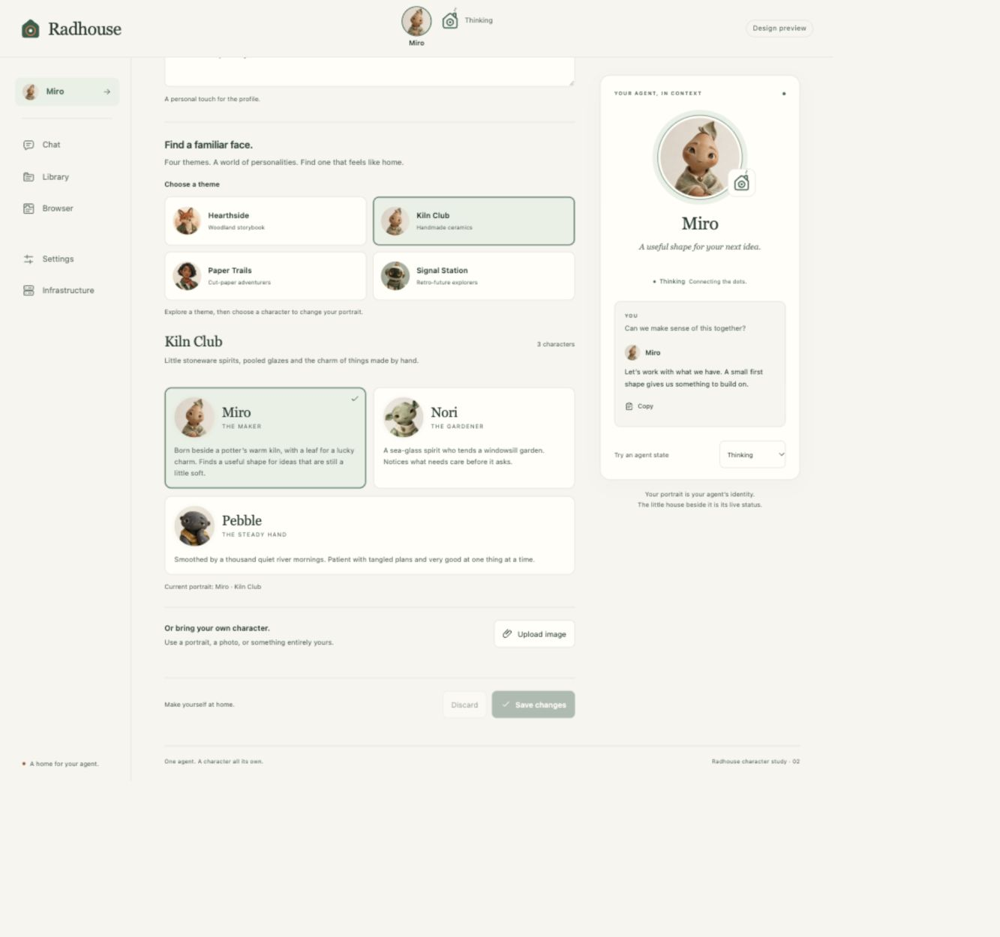
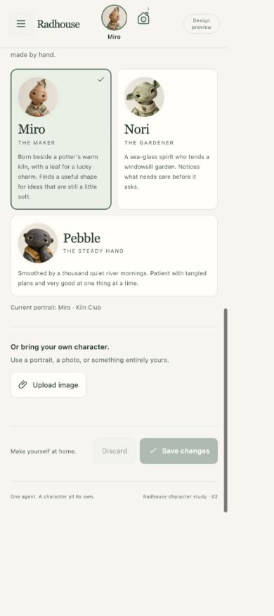

# Agent identity: runnable design mock

The [interactive agent settings page](../../brand/agent-settings.html) is a
checked-in documentation mock and a source reference for the main UI. Keep it
runnable as the product adopts its components. The owner requested retaining
this preview in documentation on 2026-10-08.

## Run the mock

From the repository root:

```sh
python3 brand/preview_settings.py --port 61491
```

Open <http://127.0.0.1:61491/>. No dependency installation or application build is
required. The server binds to loopback and exposes only the mock's listed public
assets. Relative asset paths also work when the `brand` directory is served by
an ordinary static documentation server; there are no external font or image requests.

Try the four collections, choose a portrait, enter a name, and change the
Appearance controls. The live card, centered header portrait, and first menu item
update together. Browse collections without replacing the selected identity.
Save persists in this browser preview; Discard restores the last saved identity.
The state picker illustrates runtime states. Other menu entries provide context.

## Four visual collections

| Collection | Direction | Characters |
| --- | --- | --- |
| Hearthside | Warm woodland storybook portraits; the original theme | Ember, Moss, Aster, Lumi |
| Kiln Club | Handcrafted ceramic spirits, textured clay and pooled glazes | Miro, Nori, Pebble |
| Paper Trails | Layered cut-paper people, makers and adventurers | Rue, Kit, Sol |
| Signal Station | Retro-future explorers in brass, enamel and soft green | Beacon, Echo, Orbit |

Short character profiles and design rules are in
[the identity concept](../../brand/AGENT-IDENTITY.md). The owner liked the original
four portraits as the first theme; the other collections remain design candidates.
All 13 portraits are real raster assets, with their generation prompts preserved
in [the asset ledger](../../brand/characters/PROMPTS.md).

## Mock screenshots

Desktop collection browsing with Kiln Club selected:



Compact character cards below the fixed identity header:



These captures are a reference for this iteration. Use the runnable mock to
inspect the other collections, appearance states and interactions.

## Component reuse map

The mock has no framework dependency. These are extraction boundaries, with the
working HTML/CSS/JavaScript available for comparison during implementation.

| Component | Mock source / hook | Main-UI reuse |
| --- | --- | --- |
| Agent navigation item | `agent-settings.html`: `.nav-agent`, `[data-name]` | First item above Chat; trimmed display name or Your Agent; link to the agent profile |
| Centered identity header | `.header-identity`, `.profile-button`, `.header-status`; layout in `agent-settings.css` | Round portrait centered independently of the adjacent status mark; fixed desktop/mobile layout and 44px hit areas |
| Character catalog | `characters/catalog.js`: `RadhouseCharacters.themes` and `.profiles` | Immutable presentation metadata with stable IDs, asset names, roles and brief stories; names remain optional suggestions |
| Theme picker | `#theme-options`; `browseCollection()` in `agent-settings.js` | Native radio collection selector; browsing remains separate from the selected portrait |
| Portrait cards | `#character-grid`, `.character-option`; `renderPortraits()` | Native radio cards with portrait, name, role, story and visible selected state |
| Profile summary | `.preview-card`, `.portrait-stage`, `[data-portrait]` | Shared presentation of portrait, display name, introduction and separate status; reuse independently of the synthetic chat example |
| Identity form | `#identity-form`, `syncInputs()`, `validate()`, `update()` | Bounded name/introduction fields, explicit draft/save/discard lifecycle and custom-name preservation |
| Appearance tokens | `--accent`, `--soft`, `--paper`, `--panel`, `--ink`, `--muted`, `--line` | Reuse color roles and surface choices while aligning values with the main UI's existing tokens |
| Navigation drawer and tabs | `menu()` / `showTab()`, inert background, tab roles | Retain Escape dismissal, focus wrapping, native radio keys and tab-arrow navigation when adopting the layout |
| Shared icons | Accepted V1 pinned files in `agent-icon-snapshot/` | Use the canonical `src/radhouse/chat/static/navigation.js` and `.css` in the product; do not create a second icon implementation |

The [HTML](../../brand/agent-settings.html), [styles](../../brand/agent-settings.css)
and [controller](../../brand/agent-settings.js) form one canonical mock. Documentation
links to those sources instead of duplicating the page and letting copies drift.

## Integration boundary

Adopt display identity separately from the immutable runtime agent ID. Renaming
changes the visible profile and menu label while keeping conversations, memory,
permissions and runtime binding. Character stories and example replies are design
flavor; they do not become system prompts or imply a new specialist agent.

Replace browser-local draft storage with the existing authenticated settings
contract once identity ownership and persistence scope are settled. Replace
uploaded data URLs with validated raster asset references. Keep current portrait
IDs stable, and introduce production-sized image renditions through the asset
pipeline while retaining the original artwork and prompts in the design reference.

Replace the synthetic state selector with the existing authoritative reply/control
status adapter. Keep the house mark separate from portrait identity and pair its
state with accessible text. The mock studies independent state/interface motion;
the accepted V1 icon implementation currently uses one browser-wide Icon animation
preference. Reconcile that interaction during adoption using its shared controller,
including cross-tab preference updates and device reduced motion.

The preview is a documentation deliverable on `codex/agent-personalization-settings`.
It is not a production settings implementation or a deployment.
