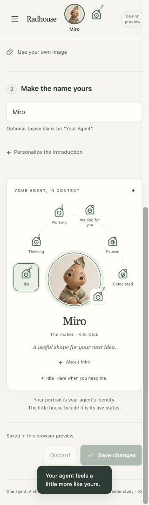

# Agent identity: runnable design mock

The [interactive agent settings page](../../brand/agent-settings.html) is a
checked-in documentation mock and a source reference for the main UI. Keep it
runnable as the product adopts its components. The owner requested retaining
this preview in documentation on 2026-10-08.

## Run the mock

From the repository root:

```sh
python3 brand/preview_settings.py --port 61491
```

Open <http://127.0.0.1:61491/>. No dependency installation or application build is
required. The server binds to loopback and exposes only the mock's listed public
assets. Relative asset paths also work when the `brand` directory is served by
an ordinary static documentation server; there are no external font or image requests.

Identity presents one sequence: **Theme → Character → Name**. Choosing a theme
selects a character immediately and shows the alternatives directly beneath it.
The live card, centered header portrait and first menu item update together.
Character stories are behind About; the introduction editor is optional and
collapsed. An explicit personal name/introduction survives character changes.
Save persists in this browser preview; Discard restores the saved identity.

The six state buttons form a semicircle around the profile portrait. Hover or
keyboard focus previews a state; leaving returns to the selected state. Click,
tap or Enter/Space selects it. The selection stays marked while another state
is previewed. These are illustrative states, separate from saved identity or
runtime commands. Other menu entries provide context.

On compact screens, the choices come first, followed by the live profile, then
Save. The fixed portrait/header status remains visible throughout.

## Four visual collections

| Collection | Direction | Characters |
| --- | --- | --- |
| Hearthside | Warm woodland storybook portraits; the original theme | Ember, Moss, Aster, Lumi |
| Kiln Club | Handcrafted ceramic spirits, textured clay and pooled glazes | Miro, Nori, Pebble |
| Paper Trails | Layered cut-paper people, makers and adventurers | Rue, Kit, Sol |
| Signal Station | Retro-future explorers in brass, enamel and soft green | Beacon, Echo, Orbit |

Short character profiles and design rules are in
[the identity concept](../../brand/AGENT-IDENTITY.md). The owner directionally accepted the
images for the first version and liked Appearance. The revised Identity flow
and state arc were reviewed as a documentation mock, with the current work
authorized for committing on 2026-10-08.
All 13 portraits are real raster assets, with their generation prompts preserved
in [the asset ledger](../../brand/characters/PROMPTS.md).

## Mock screenshots

Desktop theme-first Identity with the six-state arc:


Compact Identity starts with theme and character choices:


The same state arc supports tap selection on compact screens:



These captures are a reference for this iteration. Use the runnable mock to
inspect the other collections, appearance states and interactions.

## Component reuse map

The mock has no framework dependency. These are extraction boundaries, with the
working HTML/CSS/JavaScript available for comparison during implementation.

| Component | Mock source / hook | Main-UI reuse |
| --- | --- | --- |
| Agent navigation item | `agent-settings.html`: `.nav-agent`, `[data-name]` | First item above Chat; trimmed display name or Your Agent; link to the agent profile |
| Centered identity header | `.header-identity`, `.profile-button`, `.header-status`; layout in `agent-settings.css` | Round portrait centered independently of the adjacent status mark; fixed desktop/mobile layout and 44px hit areas |
| Character catalog | `characters/catalog.js`: `RadhouseCharacters.themes` and `.profiles` | Immutable presentation metadata with stable IDs, asset names, roles and brief stories; names remain optional suggestions |
| Theme picker | `#theme-options`; `chooseTheme()` in `agent-settings.js` | Native radio theme selector; selecting a theme updates its character selection and preview together |
| Portrait cards | `#character-grid`, `.character-option`; `renderPortraits()` | Compact native radio cards with portrait, name, role and visible selection; disclose the selected story in the preview |
| Interactive state arc | `#state-options`, `.state-orbit`; `renderPreviewState()` | Reusable preview interaction: hover/focus is transient, click/tap/Enter pins, pointer exit/blur restores selection; runtime state remains authoritative in the main UI |
| Profile summary | `.preview-card`, `.portrait-stage`, `[data-portrait]` | Shared presentation of portrait, display name, introduction and separate status; reuse independently of the synthetic chat example |
| Identity form | `#identity-form`, `syncInputs()`, `validate()`, `update()` | Optional name/introduction after visual choices; explicit draft/save/discard lifecycle, form-associated Save and custom-name preservation |
| Appearance tokens | `--accent`, `--soft`, `--paper`, `--panel`, `--ink`, `--muted`, `--line` | Reuse color roles and surface choices while aligning values with the main UI's existing tokens |
| Navigation drawer and tabs | `menu()` / `showTab()`, inert background, tab roles | Retain Escape dismissal, focus wrapping, native radio keys and tab-arrow navigation when adopting the layout |
| Shared icons | Accepted V1 pinned files in `agent-icon-snapshot/` | Use the canonical `src/radhouse/chat/static/navigation.js` and `.css` in the product; do not create a second icon implementation |

The [HTML](../../brand/agent-settings.html), [styles](../../brand/agent-settings.css)
and [controller](../../brand/agent-settings.js) form one canonical mock. Documentation
links to those sources instead of duplicating the page and letting copies drift.

## Integration boundary

Adopt display identity separately from the immutable runtime agent ID. Renaming
changes the visible profile and menu label while keeping conversations, memory,
permissions and runtime binding. Character stories and example replies are design
flavor; they do not become system prompts or imply a new specialist agent.

Replace browser-local draft storage with an owner-scoped authenticated read/save
contract. The current `/admin/settings` contract is read-only; adopting this
mock requires a new presentation save endpoint using the existing session and
CSRF mechanisms. Replace
uploaded data URLs with validated raster asset references. Keep current portrait
IDs stable, and introduce production-sized image renditions through the asset
pipeline while retaining the original artwork and prompts in the design reference.

Replace the synthetic state preview controller with the existing authoritative
reply/control status adapter. Keep the house mark separate from portrait identity and pair its
state with accessible text. The mock studies independent state/interface motion;
the accepted V1 icon implementation currently uses one browser-wide Icon animation
preference. Reconcile that interaction during adoption using its shared controller,
including cross-tab preference updates and device reduced motion.

The preview is a documentation deliverable on `codex/agent-personalization-settings`.
The owner reviewed this revision and authorized committing the work so far on 2026-10-08.
It is not a production settings implementation or a deployment.

## Production adoption plan

The design was integrated with the owner-workspace source on 2026-10-08 while
preserving the application, runtime and tests unchanged. Production adoption
can be a deployment-target web-only release; it does not require a Hermes upgrade or another
VM/service.

| Slice | Source and contract | Acceptance |
| --- | --- | --- |
| Persist presentation | Add an owner presentation record to `ChatStore`, keyed by authenticated immutable principal ID. Proposed `GET`/`POST /chat/agent-profile` reads/saves optional name and introduction, stable theme/character IDs and validated appearance choices. The server derives ownership; POST requires the existing CSRF check. | Save survives reload; another principal cannot read/write the record; invalid IDs and unsafe text cannot become asset paths or rendered HTML. Existing instance settings remain read-only. |
| Adopt the owner shell | Add authenticated `/agent`, the first navigation item and centered portrait to the shared chat/admin layout. Retain Chat, Library, Browser, Terminal and About You. Reuse the canonical icons and actual reply-state adapter. | Save/Discard, keyboard focus, 320/390px layouts, cross-tab appearance and device reduced motion work. Synthetic preview states never issue runtime commands or report invented live states. |
| Package assets | Generate small production renditions of the approved catalog portraits and package their immutable catalog under existing static assets. Load visible/selected portraits; retain original artwork and prompts here. Custom uploaded portraits need a validated raster asset endpoint before adoption. | Runtime pages serve the optimized assets and stable IDs; no full artwork preloading or browser-local data URL persistence is required. |
| Release | Qualify persistence, owner/CSRF isolation, safe rendering, navigation and existing browser/terminal regressions; freeze a new web package and deploy on deployment-target. Keep the current release and its native/browser pins intact until that package is ready. | Actual web retention/health and authenticated UI checks pass. Runtime IDs, prompts, memory, tool permissions and model choices remain unchanged. |

### Saved identity and quiet chat implementation

The owner authorized this functional adoption and a quieter chat composer on
8 October. This is D2 structural work because it adds a presentation save
contract. The existing authenticated web application and SQLite `ChatStore`
remain the only components involved; no new service or Hermes change is needed.

`GET /chat/agent-profile` returns `radhouse.agent-profile.v1`, a revision and
`name`, `intro`, `theme`, `portrait`, `accent`, `surface`, `stateMotion` and
`iconMotion`. An absent owner record returns defaults without creating a chat
or calling the inference engine. `POST` accepts the complete same shape with
the current revision. Existing session authorization derives the immutable
principal and enforces Origin/CSRF; clients cannot choose an owner or runtime ID.
Names are at most 32 characters and introductions at most 160. Theme/portrait
pairs come from the packaged approved catalog, appearance values are closed
choices, and motion values are strict booleans. Unknown fields are rejected.
An atomic revision comparison returns a conflict rather than overwriting edits
from another tab. The UI keeps the draft and offers review of the saved version.

The store adds one owner-keyed table using the existing additive schema-3
initialization. Application profile code may depend on authentication and
`ChatStore`; neither the agent gateway nor memory/model contracts depend on
presentation. Saving or renaming never dispatches a message or changes prompts,
permissions, memory, files or the runtime binding. Original artwork remains in
the documentation reference; production packages only small WebP renditions
and a fixed catalog through explicit static routes. Custom uploads are outside
this first functional slice.

The shell adds `/agent`, a first navigation item and centered portrait with a
separate actual reply-status mark. Identity and Appearance use explicit Save
and Discard; draft preview is reversible, saved choices survive reload, and
cross-tab updates cannot silently replace an unsaved edit. Device reduced
motion takes precedence over both saved motion switches. The existing shared
icon controller owns motion; profile code does not create another icon family
or expose the mock's synthetic runtime controls.

Chat retains the message box, attachment action and Send as its primary row.
A compact Message options disclosure holds browser/terminal context and
configured-engine choices, refresh and availability information. Selected
context remains visible as short removable chips; full page titles and engine
details stay in the disclosure. Copy actions remain keyboard/touch accessible
while becoming visually quieter. This changes presentation only: current
message acceptance, retry identity and browser/terminal context capture remain
unchanged; sending during an active reply belongs to its separately researched
slice.

Call paths are `authenticated session → profile GET/POST → validated catalog
and revision → owner-keyed store → saved shell presentation`, and `composer
options → existing context/model selection → existing durable message send`.
Invalid requests write nothing, stale saves preserve the draft, and unavailable
profile loading leaves chat usable with the default presentation. Focused API
tests cover owner/CSRF isolation, persistence, concurrent saves and invalid
inputs. Browser checks cover Save/Discard/reload, safe text, saved surfaces,
320/390px layouts, keyboard/reduced motion, quiet composer disclosures and
existing Browser/Terminal navigation. The final deployment-target package must enumerate
the new static assets and preserve current native pins and owner data.

## Echo portrait motion

Echo's live header, menu portrait and identity preview use the neutral pose and
A (Curious), B (Thoughtful), C (Playful) clips from
[the robot prototype](../../brand/robot-avatar/README.md). The shipped MP4s and
poster in `src/radhouse/chat/static/agent-profile/echo/` are byte-for-byte copies
of the approved v2 A and B/C assets. The picker keeps its static character cards.

A visible portrait rests for a random 2–6 seconds, plays one complete clip, then
returns to neutral before beginning the next rest. Shuffled bags include all
three clips and prevent adjacent repeats across bag boundaries. Each visible
portrait runs independently. This is character idle motion, not an inference
status signal; the house mark continues to show runtime status.

Device reduced motion and the saved Agent state animation preference keep the
neutral still. Hidden pages and off-screen portraits cancel playback, release
the decoder and resume with a fresh rest interval when visible. Selecting a
different character or signing out removes the player and its listeners. Video
failures retain the neutral still. No animation asset loads for other characters.
